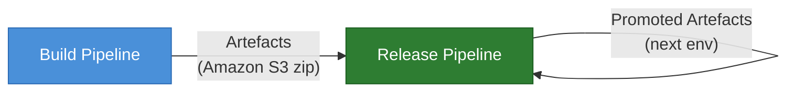
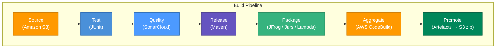
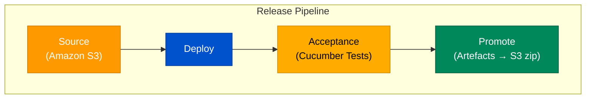
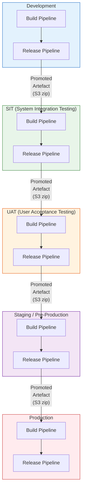
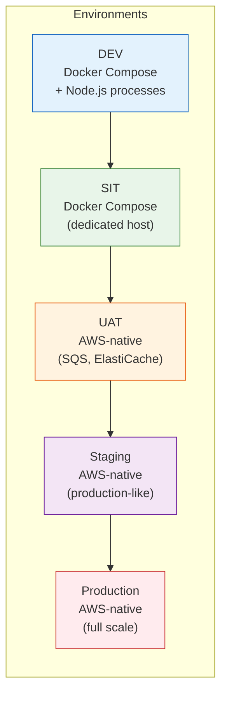
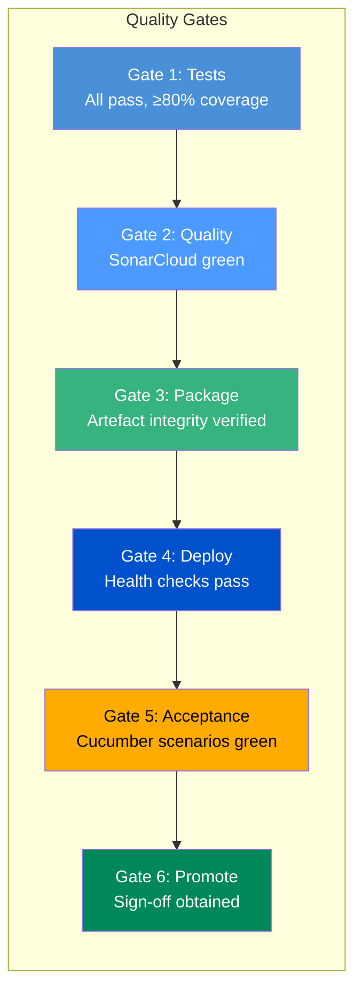
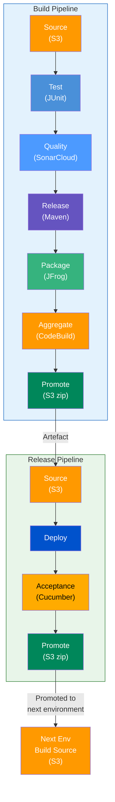

# CI/CD Integration — Pipelines & Process

**Project:** AWS Integration Example — SOAP/Event-Driven Integration Platform  
**Version:** 1.0  
**Date:** 2026-03-07  

---

## Table of Contents

1. [Overview](#1-overview)
2. [Build Pipeline](#2-build-pipeline)
3. [Release Pipeline](#3-release-pipeline)
4. [Environment Promotion Flow](#4-environment-promotion-flow)
5. [Pipeline Stages in Detail](#5-pipeline-stages-in-detail)
6. [Environment Strategy](#6-environment-strategy)
7. [Artefact Management](#7-artefact-management)
8. [Quality Gates](#8-quality-gates)

---

## 1. Overview

The CI/CD process uses two complementary pipelines — a **Build Pipeline** and a **Release Pipeline** — orchestrated through AWS services. Each pipeline follows a stage-gate model where artefacts are promoted between environments only after passing defined quality gates.

The platform consists of multiple components: client applications (`core-app-1`, `siebel`), an integration layer (API Gateway, soap-processor, event-publisher, pubsub-subscriber), and a Java-based acceptance test framework. All components follow the same pipeline structure.



> **Key Principle:** The output of one pipeline becomes the input of the next. An Amazon S3 zip artefact produced by the Build Pipeline serves as the source for the Release Pipeline. Promoted artefacts from one environment become the source for the next.

---

## 2. Build Pipeline

The Build Pipeline compiles, tests, analyses, packages, and promotes artefacts. It runs on every code commit and produces a versioned, deployable artefact bundle.



### Stage Summary

| Stage | Tool / Service | Purpose |
|-------|---------------|---------|
| **Source** | Amazon S3 | Retrieve source artefacts (code bundle or previous environment artefacts) |
| **Test** | JUnit 5 | Run unit tests, contract consumer tests, and integration tests |
| **Quality** | SonarCloud | Static analysis — code smells, coverage, security vulnerabilities, duplication |
| **Release** | Maven | Version the build, resolve dependencies, produce release-ready binaries |
| **Package** | JFrog Artifactory | Publish JARs, Lambda deployment packages, and Node.js bundles to the artefact repository |
| **Aggregate** | AWS CodeBuild | Combine all artefacts into a single deployable bundle |
| **Promote** | Amazon S3 | Store the final artefact as a versioned S3 zip for downstream consumption |

---

## 3. Release Pipeline

The Release Pipeline takes a promoted artefact and deploys it to a target environment, runs acceptance tests, and — on success — promotes the artefact for the next environment.



### Stage Summary

| Stage | Tool / Service | Purpose |
|-------|---------------|---------|
| **Source** | Amazon S3 | Retrieve the promoted artefact zip from the previous pipeline or environment |
| **Deploy** | AWS CodeDeploy / CloudFormation | Deploy the artefact to the target environment (Lambda functions, Docker services, infra) |
| **Acceptance** | Cucumber 7 (BDD) | Run acceptance tests — Cucumber scenarios validate business-critical flows |
| **Promote** | Amazon S3 | On success, package and store artefacts for the next environment's release pipeline |

---

## 4. Environment Promotion Flow

Both pipelines are **environment-agnostic** — the same pipeline definition applies to any environment. The source stage pulls artefacts from the previous environment's promoted output.



### Environment Sequence

| Environment | Build Source | Release Source | Tests Run | Gate |
|-------------|-------------|---------------|-----------|------|
| **Development** | Git commit (S3 code bundle) | Build artefact | Unit, Contract, Integration, E2E | All tests pass, SonarCloud quality gate |
| **SIT** | DEV promoted artefact | SIT build artefact | Integration, E2E, Contract Provider | All tests pass |
| **UAT** | SIT promoted artefact | UAT build artefact | Cucumber BDD acceptance tests | PO sign-off |
| **Staging** | UAT promoted artefact | STG build artefact | Smoke, Performance (stress + soak) | Performance criteria met, zero S1/S2 defects |
| **Production** | STG promoted artefact | PROD build artefact | Smoke tests (post-deploy) | Change approval board |

---

## 5. Pipeline Stages in Detail

### 5.1 Source (Amazon S3)

The source stage retrieves the input artefact bundle. For the initial build (Development), this is the committed code stored as an S3 object. For subsequent environments, the source is the promoted artefact zip from the previous environment.

- **Trigger:** Code push (Development) or manual/scheduled promotion (higher environments)
- **Output:** Extracted source code or artefact bundle in the build workspace

### 5.2 Test (JUnit)

Runs the automated test suite using JUnit 5 and Vitest.

| Test Type | Framework | Scope | Approx. Duration |
|-----------|-----------|-------|:-----------------:|
| Contract Consumer | Pact (TS + JVM) | Schema validation (no infra) | ~5s |
| Contract Provider (Message) | Pact (TS + JVM) | Event schema (no infra) | ~3s |
| Infrastructure Health | Vitest / JUnit 5 | Docker services reachable | ~2s |
| Integration API | Vitest / JUnit 5 + Playwright | SOAP endpoints, routing | ~10s |
| Contract Provider (HTTP) | Pact (TS + JVM) | Provider verification | ~5s |
| E2E Pipeline | Vitest / JUnit 5 | Full async flow (HTTP → SQS → Redis) | ~45s |

### 5.3 Quality (SonarCloud)

Static analysis gate that blocks promotion if quality criteria are not met.

| Metric | Threshold |
|--------|-----------|
| Code Coverage | ≥ 80% |
| Duplicated Lines | ≤ 3% |
| New Code Smells | 0 (on new code) |
| Security Vulnerabilities | 0 |
| Reliability Rating | A |

### 5.4 Release (Maven)

Maven resolves dependencies, versions the build, and produces release-ready binaries.

- Java components: compiled JARs (playwright-java-framework, test utilities)
- Node.js components: bundled via Vite and npm package scripts
- Version tagging follows semantic versioning

### 5.5 Package (JFrog Artifactory)

| Artefact Type | Description | Repository |
|---------------|-------------|------------|
| **JARs** | Java framework, test utilities | JFrog Maven repository |
| **Lambda Packages** | soap-processor, event-publisher (zip bundles for AWS Lambda) | JFrog generic repository |
| **Node.js Bundles** | core-app-1, siebel, pubsub-subscriber | JFrog npm repository |

### 5.6 Aggregate (AWS CodeBuild)

AWS CodeBuild combines all individual artefacts into a single deployment bundle:

1. Collect JARs from JFrog
2. Collect Lambda deployment zips
3. Collect Node.js built bundles
4. Collect Docker Compose configuration and Nginx configs
5. Bundle into a versioned composite artefact

### 5.7 Promote (Artefacts → Amazon S3 zip)

The final artefact is stored in an S3 bucket with the following structure:

```
s3://project-artefacts/
  └── {environment}/
      └── {version}/
          ├── manifest.json            # Artefact metadata, version, checksums
          ├── lambdas/
          │   ├── soap-processor.zip
          │   └── event-publisher.zip
          ├── apps/
          │   ├── core-app-1.tar.gz
          │   └── siebel.tar.gz
          ├── infra/
          │   ├── docker-compose.yml
          │   └── nginx.conf
          └── tests/
              └── playwright-framework.jar
```

### 5.8 Deploy

Deployment to each environment uses environment-specific configuration:

| Component | Deployment Method |
|-----------|------------------|
| Lambda functions (soap-processor, event-publisher) | AWS Lambda update via CloudFormation / SAM |
| API Gateway | Nginx config reload or AWS API Gateway deployment |
| Queue (SQS) | Infrastructure-as-Code (CloudFormation) |
| Redis / Pub/Sub | ElastiCache configuration update |
| Client apps (core-app-1, siebel) | Container deployment or EC2 CodeDeploy |

### 5.9 Acceptance (Cucumber Tests)

Cucumber BDD scenarios run post-deploy to validate business-critical flows:

- SOAP request processing (PlannedOutage, ServiceRequest, AccountUpdate)
- End-to-end event delivery through the full async pipeline
- Cross-application round-trip (siebel event listener receives published events)
- Error handling and negative scenarios

---

## 6. Environment Strategy



| Environment | Infrastructure | Config Source | Key Characteristics |
|-------------|---------------|--------------|---------------------|
| **DEV** | Docker Compose + local Node.js | `config-local.properties` | Fast iteration, ElasticMQ for SQS, Redis for Pub/Sub |
| **SIT** | Docker Compose on dedicated host | `config-docker.properties` | Shared team environment, full integration layer |
| **UAT** | AWS-native services | `config-staging.properties` | Real SQS, ElastiCache; PO-accessible |
| **Staging** | AWS-native (production mirror) | `config-staging.properties` | Performance testing, production-like scale |
| **Production** | AWS-native (full scale) | Production config | Blue/green deployment, monitoring, alerting |

---

## 7. Artefact Management

### Artefact Lifecycle

```mermaid
flowchart LR
    CODE["Source Code"] --> BUILD["Build\n(compiled)"]
    BUILD --> TEST["Tested\n(unit + contract)"]
    TEST --> QUALITY["Analysed\n(SonarCloud)"]
    QUALITY --> PKG["Packaged\n(JFrog)"]
    PKG --> BUNDLE["Bundled\n(S3 zip)"]
    BUNDLE --> DEPLOY["Deployed\n(environment)"]
    DEPLOY --> VERIFIED["Verified\n(acceptance)"]
    VERIFIED --> PROMOTED["Promoted\n(next env S3 zip)"]

    style CODE fill:#e0e0e0,stroke:#757575
    style BUILD fill:#bbdefb,stroke:#1565c0
    style TEST fill:#4A90D9,color:#fff,stroke:#2a6ab5
    style QUALITY fill:#4C9AFF,color:#fff,stroke:#2a6ab5
    style PKG fill:#36B37E,color:#fff,stroke:#258a5e
    style BUNDLE fill:#FF9900,color:#fff,stroke:#cc7a00
    style DEPLOY fill:#0052CC,color:#fff,stroke:#003d99
    style VERIFIED fill:#FFAB00,color:#000,stroke:#cc8800
    style PROMOTED fill:#00875A,color:#fff,stroke:#005c3e
```



### Versioning Strategy

- **Build version:** `{major}.{minor}.{patch}-{buildNumber}` (e.g., `1.0.0-42`)
- **Artefact naming:** `{component}-{version}-{environment}.zip`
- **Immutable artefacts:** Once promoted, an artefact is never modified — only replaced by a new version
- **Retention:** DEV artefacts retained 7 days; SIT/UAT 30 days; Staging/Production indefinitely

---

## 8. Quality Gates

Each pipeline stage has defined quality gates that must pass before proceeding.



| Gate | Criteria | Blocks |
|------|----------|--------|
| **Test** | All unit + contract + integration tests pass; coverage ≥ 80% | Build Pipeline progression |
| **Quality** | SonarCloud quality gate passes (zero vulnerabilities, rating A) | Build Pipeline progression |
| **Package** | All artefacts published successfully; checksums validated | Aggregation |
| **Deploy** | All health endpoints return 200; infrastructure connectivity confirmed | Acceptance testing |
| **Acceptance** | All Cucumber BDD scenarios pass | Environment promotion |
| **Promote** | Acceptance passed + manual sign-off (UAT/Staging/Production) | Next environment |

### Contract Testing as a Gate

Contract tests serve as an early gate in the Build Pipeline:

- **Consumer pact tests** run in the Test stage (no infrastructure required, ~5s)
- **Provider verification** runs after Docker infrastructure is available (~5s)
- **`can-i-deploy`** check validates compatibility before any environment promotion
- A contract failure blocks the pipeline within seconds — the fastest feedback loop

---

## Appendix: End-to-End Pipeline View



---

## Appendix: Unified Holistic View

The following diagram shows the complete CI/CD process in a single view — both pipelines, all stages, quality gates, artefact flow, and environment promotion chain.

```mermaid
flowchart TB
    %% ── DEV Environment ─────────────────────────────────────
    subgraph DEV["⬡ DEV Environment"]
        direction TB

        subgraph DEV_BUILD["Build Pipeline"]
            direction LR
            D_SRC["☁ Source\nAmazon S3\n(code bundle)"]
            D_TST["⚙ Test\nJUnit / Vitest\nUnit · Contract\nIntegration · E2E"]
            D_QAL["◈ Quality\nSonarCloud\nCoverage ≥80%\n0 Vulnerabilities"]
            D_REL["⬢ Release\nMaven\nSemVer tagging"]
            D_PKG["☐ Package\nJFrog\nJARs · Lambda zips\nNode.js bundles"]
            D_AGG["☁ Aggregate\nAWS CodeBuild\nComposite bundle"]
            D_PRM["✓ Promote\nArtefacts → S3 zip"]
            D_SRC --> D_TST --> D_QAL --> D_REL --> D_PKG --> D_AGG --> D_PRM
        end

        subgraph DEV_REL["Release Pipeline"]
            direction LR
            DR_SRC["☁ Source\nS3 artefact"]
            DR_DEP["▶ Deploy\nCodeDeploy\nCloudFormation"]
            DR_ACC["✎ Acceptance\nCucumber BDD"]
            DR_PRM["✓ Promote\nArtefacts → S3 zip"]
            DR_SRC --> DR_DEP --> DR_ACC --> DR_PRM
        end

        D_PRM -- "artefact" --> DR_SRC
    end

    %% ── SIT Environment ─────────────────────────────────────
    subgraph SIT["⬡ SIT Environment"]
        direction TB

        subgraph SIT_BUILD["Build Pipeline"]
            direction LR
            S_SRC["☁ Source\nDEV artefact"]
            S_TST["⚙ Test\nIntegration · E2E\nContract Provider"]
            S_QAL["◈ Quality\nSonarCloud"]
            S_REL["⬢ Release\nMaven"]
            S_PKG["☐ Package\nJFrog"]
            S_AGG["☁ Aggregate\nCodeBuild"]
            S_PRM["✓ Promote"]
            S_SRC --> S_TST --> S_QAL --> S_REL --> S_PKG --> S_AGG --> S_PRM
        end

        subgraph SIT_REL["Release Pipeline"]
            direction LR
            SR_SRC["☁ Source"] --> SR_DEP["▶ Deploy"] --> SR_ACC["✎ Acceptance\nCucumber BDD"] --> SR_PRM["✓ Promote"]
        end

        S_PRM -- "artefact" --> SR_SRC
    end

    %% ── UAT Environment ─────────────────────────────────────
    subgraph UAT["⬡ UAT Environment"]
        direction TB

        subgraph UAT_BUILD["Build Pipeline"]
            direction LR
            U_SRC["☁ Source\nSIT artefact"]
            U_TST["⚙ Test"]
            U_QAL["◈ Quality"]
            U_REL["⬢ Release"]
            U_PKG["☐ Package"]
            U_AGG["☁ Aggregate"]
            U_PRM["✓ Promote"]
            U_SRC --> U_TST --> U_QAL --> U_REL --> U_PKG --> U_AGG --> U_PRM
        end

        subgraph UAT_REL["Release Pipeline"]
            direction LR
            UR_SRC["☁ Source"] --> UR_DEP["▶ Deploy"] --> UR_ACC["✎ Acceptance\nCucumber BDD\nPO sign-off"] --> UR_PRM["✓ Promote"]
        end

        U_PRM -- "artefact" --> UR_SRC
    end

    %% ── Staging Environment ─────────────────────────────────
    subgraph STG["⬡ Staging / Pre-Production"]
        direction TB

        subgraph STG_BUILD["Build Pipeline"]
            direction LR
            ST_SRC["☁ Source\nUAT artefact"]
            ST_TST["⚙ Test\nSmoke · Perf\nStress · Soak"]
            ST_QAL["◈ Quality"]
            ST_REL["⬢ Release"]
            ST_PKG["☐ Package"]
            ST_AGG["☁ Aggregate"]
            ST_PRM["✓ Promote"]
            ST_SRC --> ST_TST --> ST_QAL --> ST_REL --> ST_PKG --> ST_AGG --> ST_PRM
        end

        subgraph STG_REL["Release Pipeline"]
            direction LR
            STR_SRC["☁ Source"] --> STR_DEP["▶ Deploy"] --> STR_ACC["✎ Acceptance\n0 S1/S2 defects"] --> STR_PRM["✓ Promote"]
        end

        ST_PRM -- "artefact" --> STR_SRC
    end

    %% ── Production Environment ──────────────────────────────
    subgraph PROD["⬡ Production"]
        direction TB

        subgraph PROD_BUILD["Build Pipeline"]
            direction LR
            P_SRC["☁ Source\nSTG artefact"]
            P_TST["⚙ Test"]
            P_QAL["◈ Quality"]
            P_REL["⬢ Release"]
            P_PKG["☐ Package"]
            P_AGG["☁ Aggregate"]
            P_PRM["✓ Promote"]
            P_SRC --> P_TST --> P_QAL --> P_REL --> P_PKG --> P_AGG --> P_PRM
        end

        subgraph PROD_REL["Release Pipeline"]
            direction LR
            PR_SRC["☁ Source"] --> PR_DEP["▶ Deploy\nBlue/Green"] --> PR_ACC["✎ Smoke\nPost-deploy"] --> PR_PRM["✓ Live ✓"]
        end

        P_PRM -- "artefact" --> PR_SRC
    end

    %% ── Cross-environment promotion arrows ──────────────────
    DR_PRM -- "Promoted Artefact\n(S3 zip)" --> S_SRC
    SR_PRM -- "Promoted Artefact\n(S3 zip)" --> U_SRC
    UR_PRM -- "Promoted Artefact\n(S3 zip)" --> ST_SRC
    STR_PRM -- "Promoted Artefact\n(S3 zip)" --> P_SRC

    %% ── Styles ──────────────────────────────────────────────
    style DEV fill:#e3f2fd,stroke:#1565c0,stroke-width:2px
    style SIT fill:#e8f5e9,stroke:#2e7d32,stroke-width:2px
    style UAT fill:#fff3e0,stroke:#e65100,stroke-width:2px
    style STG fill:#f3e5f5,stroke:#6a1b9a,stroke-width:2px
    style PROD fill:#ffebee,stroke:#c62828,stroke-width:2px

    style DEV_BUILD fill:#bbdefb,stroke:#1565c0
    style DEV_REL fill:#c8e6c9,stroke:#2e7d32
    style SIT_BUILD fill:#bbdefb,stroke:#1565c0
    style SIT_REL fill:#c8e6c9,stroke:#2e7d32
    style UAT_BUILD fill:#bbdefb,stroke:#1565c0
    style UAT_REL fill:#c8e6c9,stroke:#2e7d32
    style STG_BUILD fill:#bbdefb,stroke:#1565c0
    style STG_REL fill:#c8e6c9,stroke:#2e7d32
    style PROD_BUILD fill:#bbdefb,stroke:#1565c0
    style PROD_REL fill:#c8e6c9,stroke:#2e7d32
```



---

## Appendix: Document Revision History

| Version | Date | Author | Changes |
|---------|------|--------|---------|
| 1.0 | 2026-03-07 | QA Team | Initial CI/CD integration documentation |
