# CI/CD Integration — Pipelines & Process

**Project:** AWS Integration Example — SOAP/Event-Driven Integration Platform  
**Version:** 1.0  
**Date:** 2026-03-07  

---

## Table of Contents

1. [Overview](#1-overview)
2. [Build Pipeline](#2-build-pipeline)
3. [Release Pipeline](#3-release-pipeline)
4. [Environment Promotion Flow](#4-environment-promotion-flow)
5. [Pipeline Stages in Detail](#5-pipeline-stages-in-detail)
6. [Environment Strategy](#6-environment-strategy)
7. [Artefact Management](#7-artefact-management)
8. [Quality Gates](#8-quality-gates)
9. [SIT End-to-End Testing Strategy](#9-sit-end-to-end-testing-strategy)

---

## 1. Overview

The CI/CD process uses two complementary pipelines — a **Build Pipeline** and a **Release Pipeline** — orchestrated through AWS services. Each pipeline follows a stage-gate model where artefacts are promoted between environments only after passing defined quality gates.

The platform consists of three independent systems, each **owned by a dedicated team** with its own pipelines and acceptance tests:

| System | Team | Components | Pipeline Scope |
|--------|------|------------|----------------|
| **core-app-1** | core-app-1 Team (2 devs + 1 QA) | PlannedOutage client application (Express :4001) | Own Build + Release pipeline |
| **siebel** | siebel Team (2 devs + 1 QA) | ServiceRequest, Event Listener (Express :3002) | Own Build + Release pipeline |
| **integration-layer** | Integration Layer Team (3 devs + 1 QA) | API Gateway (Nginx :8080), soap-processor (:5000), event-publisher, pubsub-subscriber, ElasticMQ, Redis | Own Build + Release pipeline |
| **Platform QA** | QA Lead + QA Automation Engineer | Cross-system E2E test orchestration | Coordinates SIT E2E tests across all systems |

> **Key Principle:** Each system team independently builds, tests, and promotes its own artefacts. The three system pipelines run **in parallel**. At the **SIT** (System Integration Testing) level, cross-system End-to-End tests — owned by Platform QA — validate that all systems work together before promotion to UAT.

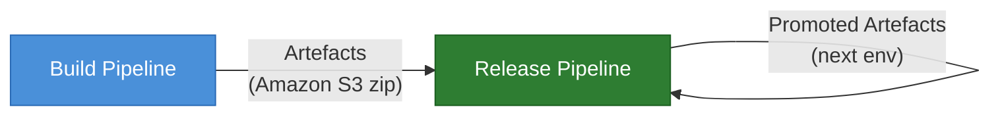

> Each system follows the same pipeline structure above, but **each team owns and operates its own instance** of the Build and Release pipelines independently.

### Per-System Pipeline Architecture

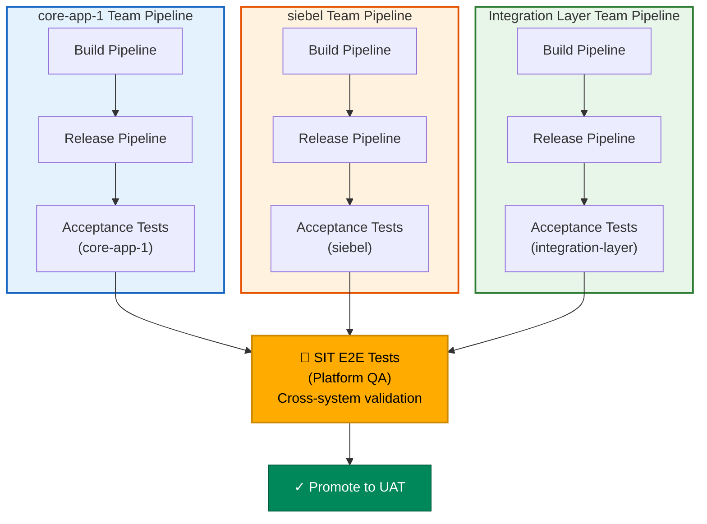

---

## 2. Build Pipeline

The Build Pipeline compiles, tests, analyses, packages, and promotes artefacts. It runs on every code commit and produces a versioned, deployable artefact bundle.

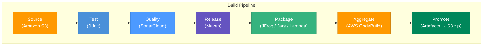

### Stage Summary

| Stage | Tool / Service | Purpose |
|-------|---------------|---------|
| **Source** | Amazon S3 | Retrieve source artefacts (code bundle or previous environment artefacts) |
| **Test** | JUnit 5 | Run unit tests, contract consumer tests, and integration tests |
| **Quality** | SonarCloud | Static analysis — code smells, coverage, security vulnerabilities, duplication |
| **Release** | Maven | Version the build, resolve dependencies, produce release-ready binaries |
| **Package** | JFrog Artifactory | Publish JARs, Lambda deployment packages, and Node.js bundles to the artefact repository |
| **Aggregate** | AWS CodeBuild | Combine all artefacts into a single deployable bundle |
| **Promote** | Amazon S3 | Store the final artefact as a versioned S3 zip for downstream consumption |

---

## 3. Release Pipeline

The Release Pipeline takes a promoted artefact and deploys it to a target environment, runs acceptance tests, and — on success — promotes the artefact for the next environment.

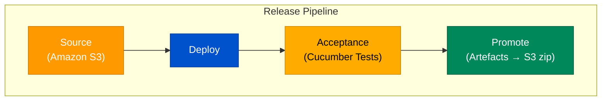

### Stage Summary

| Stage | Tool / Service | Purpose |
|-------|---------------|---------|
| **Source** | Amazon S3 | Retrieve the promoted artefact zip from the previous pipeline or environment |
| **Deploy** | AWS CodeDeploy / CloudFormation | Deploy the artefact to the target environment (Lambda functions, Docker services, infra) |
| **Acceptance** | Cucumber 7 (BDD) | Run acceptance tests — Cucumber scenarios validate business-critical flows |
| **Promote** | Amazon S3 | On success, package and store artefacts for the next environment's release pipeline |

---

## 4. Environment Promotion Flow

Both pipelines are **environment-agnostic** — the same pipeline definition applies to any environment. The source stage pulls artefacts from the previous environment's promoted output. Each system team operates its own instance of both pipelines **in parallel**.

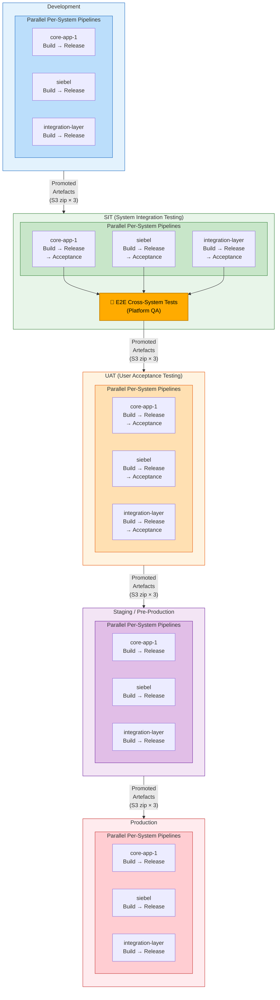

### Environment Sequence

Each system team (core-app-1, siebel, integration-layer) runs its own Build + Release pipeline **in parallel** within each environment. At **SIT**, a cross-system E2E test phase orchestrated by Platform QA runs **after** all per-system acceptance tests pass.

| Environment | Build Source | Release Source | Per-System Tests (each team) | Cross-System Tests | Gate |
|-------------|-------------|---------------|------------------------------|-------------------|------|
| **Development** | Git commit (S3 code bundle) | Build artefact | Unit, Contract, Integration, Component E2E | — | All per-system tests pass, SonarCloud quality gate |
| **SIT** | DEV promoted artefact | SIT build artefact | Integration, Contract Provider, Acceptance (Cucumber) | **E2E Cross-System Tests** (Platform QA) | All per-system acceptance + E2E cross-system pass |
| **UAT** | SIT promoted artefact | UAT build artefact | Cucumber BDD acceptance tests | — | PO sign-off per system |
| **Staging** | UAT promoted artefact | STG build artefact | Smoke, Performance (stress + soak) | — | Performance criteria met, zero S1/S2 defects |
| **Production** | STG promoted artefact | PROD build artefact | Smoke tests (post-deploy) | — | Change approval board |

---

## 5. Pipeline Stages in Detail

### 5.1 Source (Amazon S3)

The source stage retrieves the input artefact bundle. For the initial build (Development), this is the committed code stored as an S3 object. For subsequent environments, the source is the promoted artefact zip from the previous environment.

- **Trigger:** Code push (Development) or manual/scheduled promotion (higher environments)
- **Output:** Extracted source code or artefact bundle in the build workspace

### 5.2 Test (JUnit)

Runs the automated test suite using JUnit 5 and Vitest.

| Test Type | Framework | Scope | Approx. Duration |
|-----------|-----------|-------|:-----------------:|
| Contract Consumer | Pact (TS + JVM) | Schema validation (no infra) | ~5s |
| Contract Provider (Message) | Pact (TS + JVM) | Event schema (no infra) | ~3s |
| Infrastructure Health | Vitest / JUnit 5 | Docker services reachable | ~2s |
| Integration API | Vitest / JUnit 5 + Playwright | SOAP endpoints, routing | ~10s |
| Contract Provider (HTTP) | Pact (TS + JVM) | Provider verification | ~5s |
| E2E Pipeline | Vitest / JUnit 5 | Full async flow (HTTP → SQS → Redis) | ~45s |

### 5.3 Quality (SonarCloud)

Static analysis gate that blocks promotion if quality criteria are not met.

| Metric | Threshold |
|--------|-----------|
| Code Coverage | ≥ 80% |
| Duplicated Lines | ≤ 3% |
| New Code Smells | 0 (on new code) |
| Security Vulnerabilities | 0 |
| Reliability Rating | A |

### 5.4 Release (Maven)

Maven resolves dependencies, versions the build, and produces release-ready binaries.

- Java components: compiled JARs (playwright-java-framework, test utilities)
- Node.js components: bundled via Vite and npm package scripts
- Version tagging follows semantic versioning

### 5.5 Package (JFrog Artifactory)

| Artefact Type | Description | Repository |
|---------------|-------------|------------|
| **JARs** | Java framework, test utilities | JFrog Maven repository |
| **Lambda Packages** | soap-processor, event-publisher (zip bundles for AWS Lambda) | JFrog generic repository |
| **Node.js Bundles** | core-app-1, siebel, pubsub-subscriber | JFrog npm repository |

### 5.6 Aggregate (AWS CodeBuild)

AWS CodeBuild combines all individual artefacts into a single deployment bundle:

1. Collect JARs from JFrog
2. Collect Lambda deployment zips
3. Collect Node.js built bundles
4. Collect Docker Compose configuration and Nginx configs
5. Bundle into a versioned composite artefact

### 5.7 Promote (Artefacts → Amazon S3 zip)

The final artefact is stored in an S3 bucket with the following structure:

```
s3://project-artefacts/
  └── {environment}/
      └── {version}/
          ├── manifest.json            # Artefact metadata, version, checksums
          ├── lambdas/
          │   ├── soap-processor.zip
          │   └── event-publisher.zip
          ├── apps/
          │   ├── core-app-1.tar.gz
          │   └── siebel.tar.gz
          ├── infra/
          │   ├── docker-compose.yml
          │   └── nginx.conf
          └── tests/
              └── playwright-framework.jar
```

### 5.8 Deploy

Deployment to each environment uses environment-specific configuration:

| Component | Deployment Method |
|-----------|------------------|
| Lambda functions (soap-processor, event-publisher) | AWS Lambda update via CloudFormation / SAM |
| API Gateway | Nginx config reload or AWS API Gateway deployment |
| Queue (SQS) | Infrastructure-as-Code (CloudFormation) |
| Redis / Pub/Sub | ElastiCache configuration update |
| Client apps (core-app-1, siebel) | Container deployment or EC2 CodeDeploy |

### 5.9 Acceptance (Per-System Cucumber Tests)

Each system team runs its **own** Cucumber BDD acceptance tests post-deploy, validating that system's business-critical flows in isolation:

| System | Owner | Acceptance Scenarios |
|--------|-------|---------------------|
| **core-app-1** | core-app-1 QA | PlannedOutage SOAP request processing, UI form validation, error handling |
| **siebel** | siebel QA | ServiceRequest submission, AccountUpdate processing, event listener behaviour |
| **integration-layer** | Integration Layer QA | API Gateway routing, SOAP message transformation, queue delivery, pub/sub event distribution |

> **Important:** Each team is responsible for maintaining and running their own acceptance tests. A system's acceptance tests must all pass before the cross-system E2E phase can begin at SIT.

### 5.10 SIT E2E Cross-System Tests

At the **SIT** (System Integration Testing) environment, after all three systems pass their individual acceptance tests, Platform QA orchestrates **cross-system E2E tests** that validate the full integration chain:

- SOAP request originates from core-app-1 → routed through API Gateway → processed by soap-processor → queued to SQS → consumed by event-publisher → published to Redis → received by siebel event-listener
- Event-driven round-trip: siebel sends event → integration-layer processes → core-app-1 receives notification
- Failure propagation: error in one system produces the correct downstream behaviour in others
- Data consistency: work order created in one system is accurately reflected across all systems

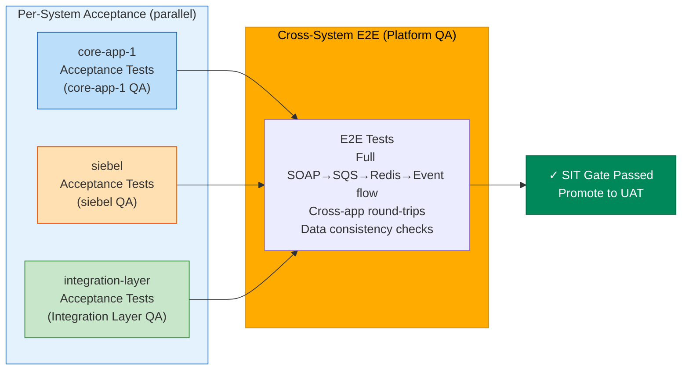

| E2E Scenario | Systems Involved | Validation |
|-------------|-----------------|------------|
| SOAP-to-Event pipeline | core-app-1 → integration-layer → siebel | Full async flow completes within SLA |
| Bidirectional event sync | siebel ↔ integration-layer ↔ core-app-1 | Events propagated and acknowledged |
| Error cascading | Any → integration-layer → downstream | Correct error codes and DLQ routing |
| Data round-trip | core-app-1 → all systems | Data integrity preserved across boundaries |

---

## 6. Environment Strategy

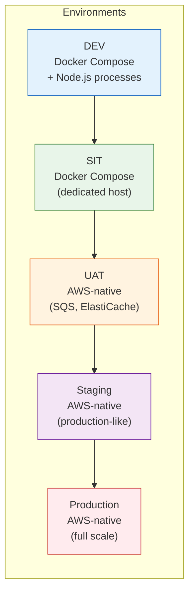

| Environment | Infrastructure | Config Source | Key Characteristics |
|-------------|---------------|--------------|---------------------|
| **DEV** | Docker Compose + local Node.js | `config-local.properties` | Fast iteration, ElasticMQ for SQS, Redis for Pub/Sub |
| **SIT** | Docker Compose on dedicated host | `config-docker.properties` | Shared team environment, full integration layer |
| **UAT** | AWS-native services | `config-staging.properties` | Real SQS, ElastiCache; PO-accessible |
| **Staging** | AWS-native (production mirror) | `config-staging.properties` | Performance testing, production-like scale |
| **Production** | AWS-native (full scale) | Production config | Blue/green deployment, monitoring, alerting |

---

## 7. Artefact Management

### Artefact Lifecycle

```mermaid
flowchart LR
    CODE["Source Code"] --> BUILD["Build\n(compiled)"]
    BUILD --> TEST["Tested\n(unit + contract)"]
    TEST --> QUALITY["Analysed\n(SonarCloud)"]
    QUALITY --> PKG["Packaged\n(JFrog)"]
    PKG --> BUNDLE["Bundled\n(S3 zip)"]
    BUNDLE --> DEPLOY["Deployed\n(environment)"]
    DEPLOY --> VERIFIED["Verified\n(acceptance)"]
    VERIFIED --> PROMOTED["Promoted\n(next env S3 zip)"]

    style CODE fill:#e0e0e0,stroke:#757575
    style BUILD fill:#bbdefb,stroke:#1565c0
    style TEST fill:#4A90D9,color:#fff,stroke:#2a6ab5
    style QUALITY fill:#4C9AFF,color:#fff,stroke:#2a6ab5
    style PKG fill:#36B37E,color:#fff,stroke:#258a5e
    style BUNDLE fill:#FF9900,color:#fff,stroke:#cc7a00
    style DEPLOY fill:#0052CC,color:#fff,stroke:#003d99
    style VERIFIED fill:#FFAB00,color:#000,stroke:#cc8800
    style PROMOTED fill:#00875A,color:#fff,stroke:#005c3e
```

### Versioning Strategy

- **Build version:** `{major}.{minor}.{patch}-{buildNumber}` (e.g., `1.0.0-42`)
- **Artefact naming:** `{component}-{version}-{environment}.zip`
- **Immutable artefacts:** Once promoted, an artefact is never modified — only replaced by a new version
- **Retention:** DEV artefacts retained 7 days; SIT/UAT 30 days; Staging/Production indefinitely

---

## 8. Quality Gates

Each pipeline stage has defined quality gates that must pass before proceeding.

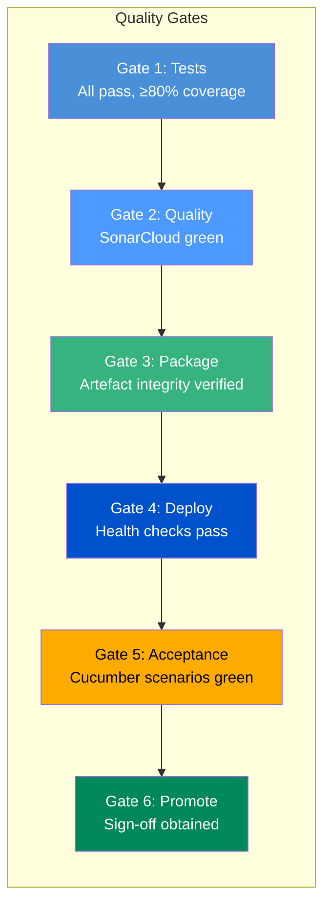

| Gate | Criteria | Blocks |
|------|----------|--------|
| **Test** | All unit + contract + integration tests pass; coverage ≥ 80% | Build Pipeline progression |
| **Quality** | SonarCloud quality gate passes (zero vulnerabilities, rating A) | Build Pipeline progression |
| **Package** | All artefacts published successfully; checksums validated | Aggregation |
| **Deploy** | All health endpoints return 200; infrastructure connectivity confirmed | Acceptance testing |
| **Acceptance** | All Cucumber BDD scenarios pass (per-system) | Environment promotion |
| **SIT E2E** | All cross-system E2E tests pass (Platform QA) | SIT → UAT promotion |
| **Promote** | Acceptance + E2E passed + manual sign-off (UAT/Staging/Production) | Next environment |

### Contract Testing as a Gate

Contract tests serve as an early gate in the Build Pipeline:

- **Consumer pact tests** run in the Test stage (no infrastructure required, ~5s)
- **Provider verification** runs after Docker infrastructure is available (~5s)
- **`can-i-deploy`** check validates compatibility before any environment promotion
- A contract failure blocks the pipeline within seconds — the fastest feedback loop

---

## 9. SIT End-to-End Testing Strategy

### Purpose

SIT (System Integration Testing) is the **first environment where all three systems run together**. While each system team validates its own components via acceptance tests, Platform QA orchestrates an additional layer of **cross-system E2E tests** that verify the integrated behaviour of the entire platform.

### Execution Flow

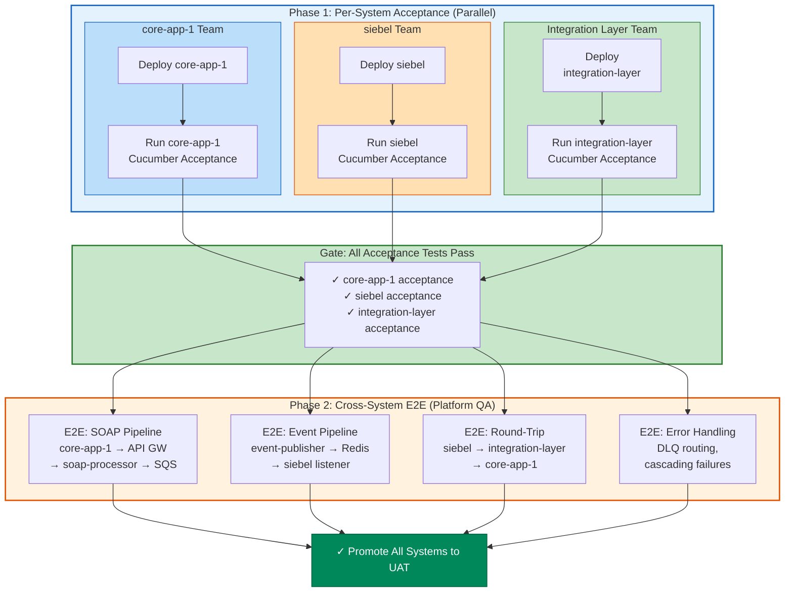

### Ownership & Responsibilities

| Role | Responsibility |
|------|---------------|
| **core-app-1 QA** | Writes and maintains core-app-1 acceptance tests; reviews E2E scenarios touching core-app-1 |
| **siebel QA** | Writes and maintains siebel acceptance tests; reviews E2E scenarios touching siebel |
| **Integration Layer QA** | Writes and maintains integration-layer acceptance tests; reviews E2E scenarios touching the integration layer |
| **Platform QA (QA Lead)** | Defines E2E test strategy, reviews all E2E scenarios, coordinates SIT gate sign-off |
| **Platform QA (QA Automation)** | Implements and maintains cross-system E2E test suites; manages shared test infrastructure |

### SIT Promotion Rule

> **A system's artefact cannot be promoted from SIT to UAT independently.** All three systems must pass their individual acceptance tests **and** the cross-system E2E suite must pass before **any** artefact is promoted. This ensures integration integrity at all times.

---

## Appendix: End-to-End Pipeline View

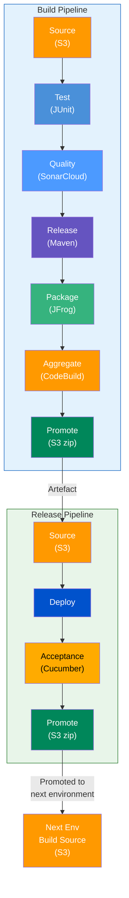

---

## Appendix: Unified Holistic View

The following diagram shows the complete CI/CD process in a single view — per-system parallel pipelines, the SIT E2E gate, quality gates, artefact flow, and environment promotion chain.

```mermaid
flowchart TB
    %% ── DEV Environment ─────────────────────────────────────
    subgraph DEV["⬡ DEV Environment"]
        direction TB

        subgraph DEV_CA1["core-app-1 Pipeline"]
            direction LR
            D_CA1_B["☁ Source → ⚙ Test → ◈ Quality → ⬢ Release → ☐ Package → ☁ Aggregate → ✓ Promote"]
        end
        subgraph DEV_SBL["siebel Pipeline"]
            direction LR
            D_SBL_B["☁ Source → ⚙ Test → ◈ Quality → ⬢ Release → ☐ Package → ☁ Aggregate → ✓ Promote"]
        end
        subgraph DEV_IL["integration-layer Pipeline"]
            direction LR
            D_IL_B["☁ Source → ⚙ Test → ◈ Quality → ⬢ Release → ☐ Package → ☁ Aggregate → ✓ Promote"]
        end

        subgraph DEV_REL["Release (per-system parallel)"]
            direction LR
            DR_CA1["core-app-1: Deploy → Acceptance"]
            DR_SBL["siebel: Deploy → Acceptance"]
            DR_IL["integration-layer: Deploy → Acceptance"]
        end

        D_CA1_B --> DR_CA1
        D_SBL_B --> DR_SBL
        D_IL_B --> DR_IL
    end

    %% ── SIT Environment ─────────────────────────────────────
    subgraph SIT["⬡ SIT Environment"]
        direction TB

        subgraph SIT_TEAMS["Per-System Build + Release + Acceptance (parallel)"]
            direction LR
            S_CA1["core-app-1\nBuild → Release\n→ Acceptance ✓"]
            S_SBL["siebel\nBuild → Release\n→ Acceptance ✓"]
            S_IL["integration-layer\nBuild → Release\n→ Acceptance ✓"]
        end

        SIT_GATE["🔗 SIT E2E Cross-System Tests\n(Platform QA)\nSOAP pipeline · Event pipeline\nRound-trip · Error cascading"]

        S_CA1 --> SIT_GATE
        S_SBL --> SIT_GATE
        S_IL --> SIT_GATE
    end

    %% ── UAT Environment ─────────────────────────────────────
    subgraph UAT["⬡ UAT Environment"]
        direction TB

        subgraph UAT_TEAMS["Per-System Build + Release + Acceptance (parallel)"]
            direction LR
            U_CA1["core-app-1\nAcceptance + PO sign-off"]
            U_SBL["siebel\nAcceptance + PO sign-off"]
            U_IL["integration-layer\nAcceptance + PO sign-off"]
        end
    end

    %% ── Staging Environment ─────────────────────────────────
    subgraph STG["⬡ Staging / Pre-Production"]
        direction TB

        subgraph STG_TEAMS["Per-System Build + Release (parallel)"]
            direction LR
            ST_CA1["core-app-1\nSmoke · Perf"]
            ST_SBL["siebel\nSmoke · Perf"]
            ST_IL["integration-layer\nSmoke · Perf · Stress · Soak"]
        end
    end

    %% ── Production Environment ──────────────────────────────
    subgraph PROD["⬡ Production"]
        direction TB

        subgraph PROD_TEAMS["Per-System Build + Release (parallel)"]
            direction LR
            P_CA1["core-app-1\nBlue/Green Deploy\n→ Smoke ✓"]
            P_SBL["siebel\nBlue/Green Deploy\n→ Smoke ✓"]
            P_IL["integration-layer\nBlue/Green Deploy\n→ Smoke ✓"]
        end
    end

    %% ── Cross-environment promotion arrows ──────────────────
    DEV -- "Promoted Artefacts\n(S3 zip × 3 systems)" --> SIT
    SIT_GATE -- "E2E Passed → Promote\n(S3 zip × 3 systems)" --> UAT
    UAT -- "PO Sign-off → Promote\n(S3 zip × 3 systems)" --> STG
    STG -- "Perf Criteria Met → Promote\n(S3 zip × 3 systems)" --> PROD

    %% ── Styles ──────────────────────────────────────────────
    style DEV fill:#e3f2fd,stroke:#1565c0,stroke-width:2px
    style SIT fill:#e8f5e9,stroke:#2e7d32,stroke-width:2px
    style UAT fill:#fff3e0,stroke:#e65100,stroke-width:2px
    style STG fill:#f3e5f5,stroke:#6a1b9a,stroke-width:2px
    style PROD fill:#ffebee,stroke:#c62828,stroke-width:2px
    style SIT_GATE fill:#FFAB00,color:#000,stroke:#cc8800,stroke-width:3px
    style DEV_CA1 fill:#bbdefb,stroke:#1565c0
    style DEV_SBL fill:#ffe0b2,stroke:#e65100
    style DEV_IL fill:#c8e6c9,stroke:#2e7d32
    style DEV_REL fill:#e0e0e0,stroke:#757575
    style SIT_TEAMS fill:#c8e6c9,stroke:#2e7d32
    style UAT_TEAMS fill:#ffe0b2,stroke:#e65100
    style STG_TEAMS fill:#e1bee7,stroke:#6a1b9a
    style PROD_TEAMS fill:#ffcdd2,stroke:#c62828
```

---

## Appendix: Document Revision History

| Version | Date | Author | Changes |
|---------|------|--------|---------|
| 1.0 | 2026-03-07 | QA Team | Initial CI/CD integration documentation |
| 1.1 | 2026-03-07 | QA Team | Added per-system pipeline architecture, SIT E2E testing strategy, updated holistic view |
