# Test Strategy

**Project:** AWS Integration Example — SOAP/Event-Driven Integration Platform  
**Version:** 1.0  
**Date:** 2026-02-27  
**Standard Reference:** IEEE 829 / ISTQB Test Strategy Guidelines  

---

## Table of Contents

1. [Scope & Objectives](#1-scope--objectives)
2. [System Under Test](#2-system-under-test)
3. [Test Approach](#3-test-approach)
4. [Test Levels & Types](#4-test-levels--types)
5. [Tooling & Test Management](#5-tooling--test-management)
6. [Manual Testing](#6-manual-testing)
7. [Automation Testing](#7-automation-testing)
8. [Performance Testing](#8-performance-testing)
9. [Test Environment Strategy](#9-test-environment-strategy)
10. [Test Data Strategy](#10-test-data-strategy)
11. [Entry & Exit Criteria](#11-entry--exit-criteria)
12. [Risk-Based Testing](#12-risk-based-testing)
13. [Defect Management](#13-defect-management)
14. [CI/CD Integration](#14-cicd-integration)
15. [Team Structure & Responsibilities](#15-team-structure--responsibilities)
16. [Test Schedule](#16-test-schedule)
17. [Metrics & Reporting](#17-metrics--reporting)

---

## 1. Scope & Objectives

### 1.1 Purpose

This document defines the test strategy for the AWS Integration Example platform — a SOAP-based, event-driven integration system that connects client applications (core-app-1, siebel) to a shared integration layer via API Gateway, message queues, and pub/sub eventing.

### 1.2 Objectives

| # | Objective | Measurable Target |
|---|-----------|-------------------|
| O1 | Verify functional correctness of all integration points | 100% of SOAP request/response contracts pass |
| O2 | Validate end-to-end message pipeline integrity | Events arrive within 15s with zero data loss |
| O3 | Ensure backward compatibility across consumer/provider versions | All Pact contracts verified before each release |
| O4 | Establish performance baselines for throughput and latency | P95 latency < 2s under normal load |
| O5 | Minimize regression risk through automation | ≥ 90% of repeatable test cases automated |

### 1.3 In Scope

- Client applications: **core-app-1** (PlannedOutage sender), **siebel** (ServiceRequest/AccountUpdate sender + event listener)
- Integration layer: **API Gateway** (Nginx), **soap-processor**, **ElasticMQ/SQS**, **event-publisher**, **Redis Pub/Sub**, **pubsub-subscriber**
- SOAP XML contract validation (structure, namespaces, encoding)
- Async message pipeline (SQS polling, Redis event publishing)
- IntegrationEvent schema conformance
- Docker Compose infrastructure orchestration

### 1.4 Out of Scope

- AWS-native deployment (Lambda, SNS, real SQS) — tested separately in staging
- UI/front-end — no UI exists in this system
- core-app-2 — placeholder, not yet implemented
- Third-party SaaS integrations beyond the local stack

---

## 2. System Under Test

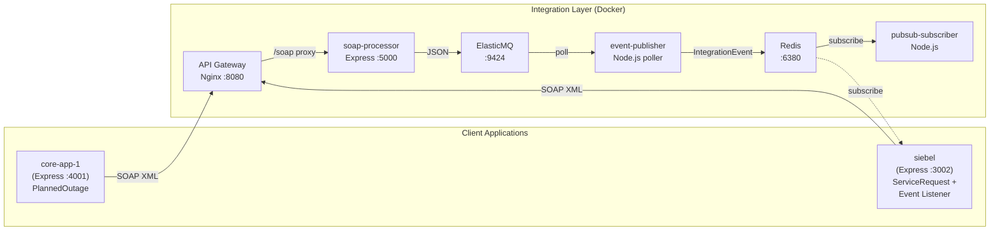

### 2.1 Integration Points (Testable Interfaces)

| ID | Interface | Protocol | Direction | Data Format |
|----|-----------|----------|-----------|-------------|
| IF-01 | core-app-1 → API Gateway | HTTP POST `/soap` | Sync | SOAP XML |
| IF-02 | siebel → API Gateway | HTTP POST `/soap` | Sync | SOAP XML |
| IF-03 | API Gateway → soap-processor | HTTP reverse proxy | Sync | SOAP XML |
| IF-04 | soap-processor → ElasticMQ | AWS SDK `SendMessage` | Sync | JSON |
| IF-05 | ElasticMQ → event-publisher | AWS SDK `ReceiveMessage` (poll) | Async | JSON |
| IF-06 | event-publisher → Redis | `PUBLISH integration-events` | Async | JSON |
| IF-07 | Redis → siebel event-listener | `SUBSCRIBE integration-events` | Async | JSON |
| IF-08 | Redis → pubsub-subscriber | `SUBSCRIBE integration-events` | Async | JSON |
| IF-09 | core-app-1 `/health` | HTTP GET | Sync | JSON |
| IF-10 | siebel `/health` | HTTP GET | Sync | JSON |
| IF-11 | API Gateway `/health` | HTTP GET | Sync | JSON |

---

## 3. Test Approach

### 3.1 Strategy Overview

The strategy follows a **risk-based, shift-left** approach using the **Test Pyramid** model adapted for integration-heavy systems:

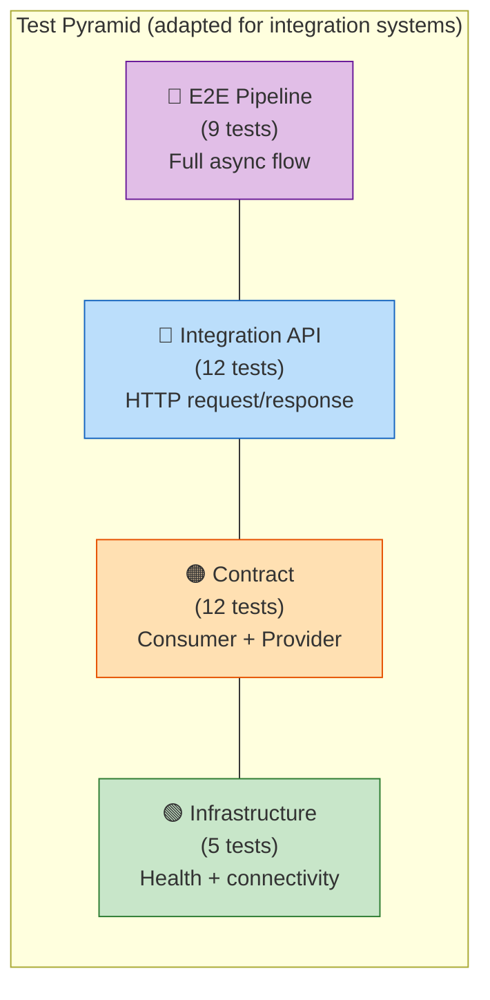

| Principle | Application |
|-----------|-------------|
| **Shift-Left** | Contract consumer tests run without Docker — ideal for pre-commit |
| **Risk-Based** | More tests at the async boundary (SQS→Redis) where failures are hardest to detect |
| **Automation-First** | 75 automated tests across TypeScript + Java; manual testing reserved for exploratory and edge cases |
| **Dual-Stack** | TypeScript (Vitest + Pact) for fast dev feedback; Java (JUnit 5 + Playwright + Pact JVM + Cucumber) for enterprise CI |

### 3.2 Test Types Matrix

| Test Type | Manual | Automated | Performance |
|-----------|:------:|:---------:|:-----------:|
| Infrastructure health | — | ✅ | — |
| API integration (SOAP) | ✅ Exploratory | ✅ | ✅ Load |
| E2E async pipeline | ✅ Smoke | ✅ | ✅ Throughput |
| Contract (consumer) | — | ✅ | — |
| Contract (provider) | — | ✅ | — |
| BDD scenarios | ✅ Review | ✅ Cucumber | — |
| Negative/error paths | ✅ Exploratory | ✅ Partial | ✅ Stress |
| Security (SOAP injection) | ✅ | 🔜 Planned | — |
| Reliability (chaos) | ✅ | 🔜 Planned | ✅ Soak |

---

## 4. Test Levels & Types

### 4.1 Test Levels

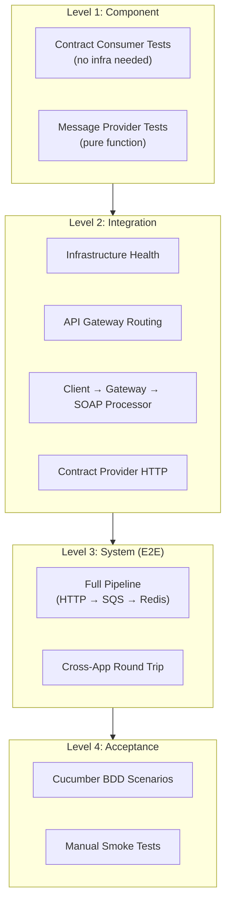

### 4.2 Test Types

| Type | Purpose | Automation Tool | Frequency |
|------|---------|-----------------|-----------|
| **Functional** | Verify all interfaces produce correct outputs | Vitest, JUnit 5 | Every commit |
| **Contract** | Lock consumer/provider schemas | Pact (TS + JVM) | Every commit |
| **Integration** | Verify multi-service interactions | Vitest, JUnit 5 + Playwright | Every PR |
| **End-to-End** | Validate full async pipeline | Vitest, JUnit 5 + EventCollector | Every PR |
| **Acceptance (BDD)** | Business-readable validations | Cucumber 7 | Every sprint |
| **Exploratory** | Discover unknown edge cases | Manual | Weekly sessions |
| **Performance** | Measure throughput, latency, stability | k6 / Artillery | Weekly + pre-release |
| **Security** | SOAP injection, payload size limits | Manual + OWASP ZAP | Per release |
| **Reliability** | Chaos/fault injection | Manual + Toxiproxy | Monthly |

---

## 5. Tooling & Test Management

### 5.1 Current State Assessment

| Area | Current Tool | Gap |
|------|-------------|-----|
| Test Case Management | Excel spreadsheets, Word documents | No traceability, version control, or audit trail |
| Test Execution Tracking | Manual email / spreadsheet updates | No real-time visibility; duplication of effort |
| Requirements Traceability | Ad-hoc manual mapping | Cannot demonstrate coverage completeness |
| Defect Tracking | Jira (tickets only) | No linkage from defects back to test cases |
| Test Reporting | Manual creation in Word / PowerPoint | Time-consuming; data often stale |

### 5.2 Recommended Tooling Stack

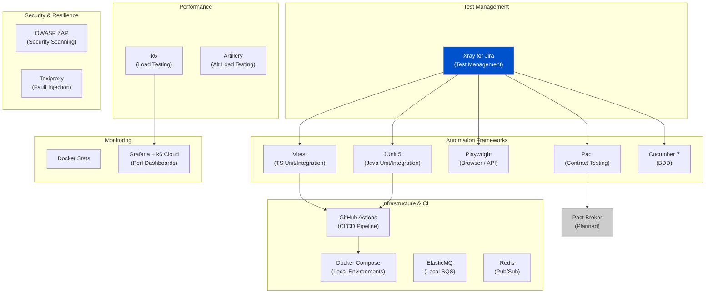

### 5.3 Test Management — Xray for Jira

**Why Xray:** Xray integrates natively with Jira, providing test case management, execution tracking, requirements traceability, and CI/CD reporting — replacing the current Excel/Word-based process.

#### 5.3.1 Migration from Excel/Word to Xray

| Phase | Activity | Timeline |
|-------|----------|----------|
| 1. Setup | Install Xray plugin; configure Jira project; create test issue types (Test, Test Set, Test Plan, Test Execution) | Week 1 |
| 2. Import | Migrate existing manual test cases (MAN-01 to MAN-06) and exploratory charters (EXP-01 to EXP-05) into Xray Test issues | Week 1–2 |
| 3. Link | Map Xray Tests to Jira requirements (Stories / Epics) for traceability | Week 2 |
| 4. Automate | Connect CI pipeline to Xray via REST API — push JUnit XML and Vitest JSON results automatically | Week 2–3 |
| 5. Train | Team training sessions on Xray workflows (create tests, execute, report) | Week 3 |
| 6. Retire | Archive Excel/Word documents; Xray becomes the single source of truth | Week 4 |

#### 5.3.2 Xray Workflow Integration

| Xray Feature | Usage in This Project |
|--------------|-----------------------|
| **Test Repository** | Organize tests by folder: Contract / Integration / E2E / Manual / Performance |
| **Test Plans** | Create per-sprint plans linking automated + manual tests |
| **Test Executions** | Track manual test runs (MAN-01–MAN-06); auto-populated for CI results |
| **Test Sets** | Group tests by risk area (R01–R08) for targeted regression |
| **Requirements Coverage** | Link Tests → Stories → Epics; dashboard shows coverage percentage |
| **CI Integration** | GitHub Actions pushes JUnit XML + Vitest JSON results to Xray via REST API |
| **Defect Linkage** | Failed test executions auto-create linked Jira defects |
| **Traceability Matrix** | Auto-generated: Requirement → Test → Execution → Defect |

### 5.4 Complete Tool Inventory

| Category | Tool | Version / Variant | Purpose | License |
|----------|------|-------------------|---------|---------|
| **Test Management** | Xray for Jira | Cloud | Test cases, execution, traceability, reporting | Commercial |
| **Project Tracking** | Jira | Cloud | Stories, defects, sprints | Commercial |
| **TS Test Framework** | Vitest | 3.x | Unit, integration, E2E tests (TypeScript) | MIT |
| **Java Test Framework** | JUnit 5 | 5.11.x | Unit, integration, E2E tests (Java) | EPL 2.0 |
| **Browser / API Testing** | Playwright | 1.50.x | HTTP API testing, future UI testing | Apache 2.0 |
| **Contract Testing (TS)** | Pact (JS) | 16.x | Consumer-driven contract testing | MIT |
| **Contract Testing (Java)** | Pact JVM | 4.6.x | Consumer-driven contract testing | Apache 2.0 |
| **Contract Broker** | Pact Broker | *(Planned)* | Central pact storage + `can-i-deploy` gate | MIT |
| **BDD Framework** | Cucumber 7 | 7.21.x | Behaviour-driven development scenarios | MIT |
| **Load Testing** | k6 | Latest | Performance: baseline, load, stress, soak, spike | AGPL-3.0 |
| **Load Testing (Alt)** | Artillery | Latest | Alternative load testing tool | MPL-2.0 |
| **Security Scanning** | OWASP ZAP | *(Planned)* | DAST — SOAP injection, payload attacks | Apache 2.0 |
| **Fault Injection** | Toxiproxy | *(Planned)* | Network fault simulation for resilience testing | MIT |
| **Containerization** | Docker Compose | v2.x | Local environment orchestration | Apache 2.0 |
| **CI/CD** | GitHub Actions | — | Automated pipeline (build, test, deploy) | — |
| **Message Queue (Local)** | ElasticMQ | Latest | SQS-compatible local queue | Apache 2.0 |
| **Pub/Sub (Local)** | Redis | 7.x | Event bus for integration events | BSD-3 |
| **Perf Monitoring** | Docker Stats + Grafana | — | Container resource monitoring during perf tests | Apache 2.0 |
| **API Testing (Manual)** | Postman / cURL | — | Ad-hoc SOAP and REST endpoint testing | — |
| **Code Coverage** | c8 (Vitest) / JaCoCo (Maven) | — | Code coverage reporting | MIT / EPL |

### 5.5 Tool-to-Phase Mapping

| Test Phase | Tools Used |
|------------|-----------|
| **Developer (local)** | Vitest, JUnit 5, Pact (consumer), Docker Compose, Postman |
| **Pull Request** | GitHub Actions, Vitest, JUnit 5, Pact (consumer + provider msg) |
| **CI Pipeline** | GitHub Actions, Docker Compose, Vitest, JUnit 5, Playwright, Pact, Cucumber |
| **Performance** | k6, Docker Compose, Grafana, Docker Stats |
| **Pre-Release** | k6 (stress/soak), Manual test plan (Xray), OWASP ZAP |
| **Test Reporting** | Xray dashboards, GitHub Actions artifacts, k6 Cloud / Grafana |
| **Defect Management** | Jira + Xray (linked defects from failed test executions) |

---

## 6. Manual Testing

### 6.1 When Manual Testing Applies

Manual testing is reserved for activities where human judgment, creativity, or visual inspection adds value beyond what automation provides.

| Activity | Rationale | Cannot Automate Because |
|----------|-----------|------------------------|
| Exploratory testing | Discover unknown edge cases | Requires domain intuition and curiosity |
| Cucumber scenario review | Validate business intent | Requires stakeholder judgment |
| New feature smoke test | Quick sanity before writing automation | Feature still changing |
| Chaos/fault injection | One-off infrastructure failure scenarios | Unique environment conditions |
| Security assessments | Creative attack vectors | Requires adversarial thinking |

### 6.2 Manual Test Cases

#### 6.2.1 Exploratory Session Charters

| Charter ID | Charter | Time-Box | Focus Area |
|------------|---------|----------|------------|
| EXP-01 | Explore SOAP request edge cases with malformed XML, oversized payloads, and special characters in field values | 60 min | IF-01, IF-02, IF-03 |
| EXP-02 | Explore pipeline behavior when services restart mid-processing (kill soap-processor while messages are in SQS) | 45 min | IF-04, IF-05 |
| EXP-03 | Explore siebel event-listener behavior when Redis publishes malformed JSON or unexpected event schemas | 45 min | IF-07 |
| EXP-04 | Explore concurrent multi-app submissions (10+ simultaneous requests from core-app-1 and siebel) and verify event ordering | 30 min | IF-01 through IF-08 |
| EXP-05 | Explore API Gateway behavior with missing Content-Type headers, wrong HTTP methods, and oversized request bodies | 30 min | IF-01, IF-02, IF-03 |

#### 6.2.2 Structured Manual Test Cases

| TC ID | Title | Precondition | Steps | Expected Result | Priority |
|-------|-------|-------------|-------|-----------------|----------|
| MAN-01 | Service recovery after Docker restart | All services running | 1. Send a valid SOAP request (verify 202). 2. `docker compose restart soap-processor`. 3. Wait for health check to pass. 4. Send another SOAP request. | Second request returns 202; event appears on Redis | High |
| MAN-02 | SQS message persistence during event-publisher downtime | Docker stack running | 1. Stop event-publisher container. 2. Send 5 SOAP requests via core-app-1. 3. Verify messages are queued in ElasticMQ (check admin UI on :9425). 4. Start event-publisher. | All 5 events eventually appear on Redis Pub/Sub | High |
| MAN-03 | SOAP request with 1MB payload | Docker stack running | 1. Construct a SOAP message with Description field containing ~1MB of text. 2. POST to `/soap`. | System either processes or returns a clear error (no silent failure or crash) | Medium |
| MAN-04 | Redis disconnection during event publishing | Docker stack running | 1. Send a valid SOAP request. 2. While message is in SQS, stop Redis container. 3. Wait 10 seconds. 4. Start Redis. 5. Send another request. | Second pipeline completes; first either retries or is dead-lettered | Medium |
| MAN-05 | Verify Cucumber features match business requirements | Feature files available | 1. Open each `.feature` file with a product owner. 2. Read each scenario aloud. 3. Confirm scenarios match acceptance criteria. | All scenarios approved as accurate representations of requirements | High |
| MAN-06 | Cross-app event isolation | Docker stack running | 1. Send ServiceRequest from siebel. 2. In parallel, send PlannedOutage from core-app-1. 3. Verify each Redis event has correct `requestId` and payload. | No cross-contamination between events | High |

### 6.3 Manual Test Execution Schedule

| Activity | Frequency | Owner | Artifacts |
|----------|-----------|-------|-----------|
| Exploratory sessions (EXP-01 to EXP-05) | Weekly (rotating 2 charters per week) | QA Engineer | Session notes, defect reports |
| Structured manual tests (MAN-01 to MAN-06) | Each sprint (pre-release) | QA Engineer | Test execution log, pass/fail |
| Cucumber business review (MAN-05) | Start of each sprint | Product Owner + QA | Updated `.feature` files |
| Security assessment | Per major release | Security Champion | OWASP findings report |

---

## 7. Automation Testing

### 7.1 Current Automation Inventory

**75 automated tests** across 23 files in two technology stacks.

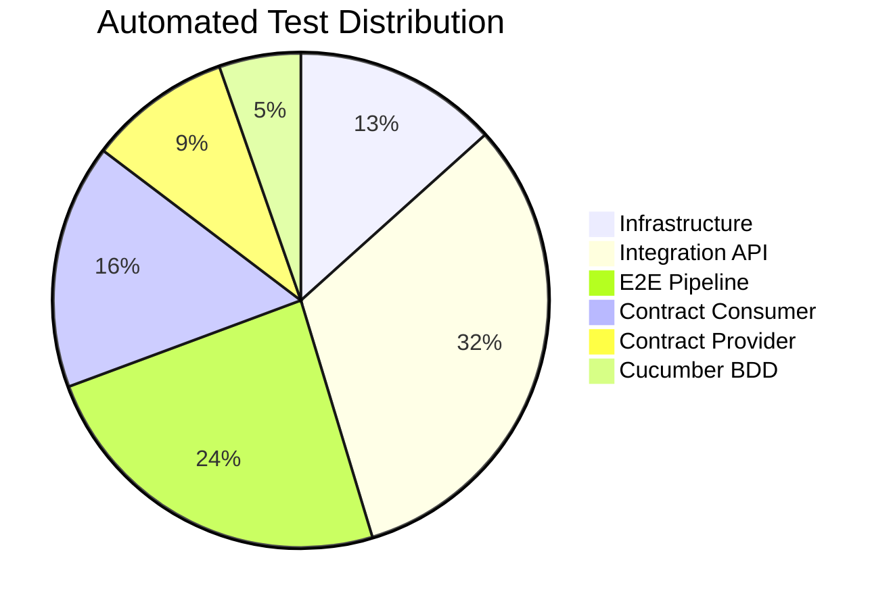

#### 7.1.1 TypeScript Suite (Vitest + Pact) — 35 Tests

| Category | Tests | Files | Requires Docker |
|----------|:-----:|:-----:|:---------------:|
| Infrastructure Health | 5 | 1 | ✅ |
| API Gateway Routing | 4 | 1 | ✅ |
| core-app-1 API | 4 | 1 | ✅ |
| siebel API | 4 | 1 | ✅ |
| E2E Pipeline | 9 | 1 | ✅ |
| Contract Consumer (HTTP) | 4 | 2 | — |
| Contract Consumer (Message) | 2 | 1 | — |
| Contract Provider (HTTP) | 2 | 1 | ✅ |
| Contract Provider (Message) | 1 | 1 | — |

#### 7.1.2 Java Suite (JUnit 5 + Playwright + Pact JVM + Cucumber) — 40 Tests

| Category | Tests | Files | Requires Docker |
|----------|:-----:|:-----:|:---------------:|
| Infrastructure Health | 5 | 1 | ✅ |
| API Gateway Routing | 4 | 1 | ✅ |
| core-app-1 API | 4 | 1 | ✅ |
| siebel API | 4 | 1 | ✅ |
| E2E Pipeline | 9 | 1 | ✅ |
| Contract Consumer (HTTP) | 4 | 2 | — |
| Contract Consumer (Message) | 2 | 1 | — |
| Contract Provider (HTTP) | 2 | 1 | ✅ |
| Contract Provider (Message) | 2 | 1 | — |
| Cucumber BDD | 4 | 4 | ✅ |

### 7.2 Automation Test Coverage Map

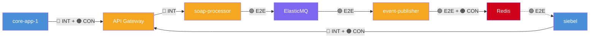

**Legend:**  
🟢 Infrastructure (health check per node) | 🔵 Integration (synchronous HTTP) | 🟣 E2E (full async pipeline) | 🟠 Contract (schema verification)

### 7.3 Automation Execution Commands

```bash
# ── TypeScript ──────────────────────────────────────────
npm run test:integration        # Infrastructure + API (17 tests)
npm run test:e2e                # Full pipeline (9 tests)
npm run test:contract:consumer  # Consumer pacts — no Docker needed (8 tests)
npm run test:contract:provider  # Provider verification — Docker needed (3 tests)
npm run test:contract           # All contract tests (11 tests)

# ── Java ────────────────────────────────────────────────
cd playwright-java-framework
mvn test -Dgroups="integration"  # Infrastructure + API + Cucumber (21 tests)
mvn test -Dgroups="e2e"          # Full pipeline (9 tests)
mvn test -Dgroups="contract"     # All contract tests (12 tests)
mvn test                         # All tests (40 tests)
```

### 7.4 Automation Gap Analysis & Roadmap

| Gap | Current State | Planned Automation | Priority | Target |
|-----|--------------|-------------------|----------|--------|
| Negative E2E paths | Manual only | Vitest + JUnit tests for SQS/Redis down scenarios | High | Q2 2026 |
| SOAP injection | Manual only | OWASP ZAP automated scans in CI | Medium | Q2 2026 |
| Retry/DLQ behavior | Not tested | JUnit tests with Toxiproxy fault injection | High | Q2 2026 |
| Payload size limits | Manual only | Parameterized tests with 1KB → 5MB payloads | Medium | Q3 2026 |
| Pact Broker integration | Pacts stored locally (``/pacts``) | Publish to Pact Broker + `can-i-deploy` gate | High | Q2 2026 |
| Message ordering | Partial (3 distinct events test) | Stress test with 100+ concurrent messages | Medium | Q3 2026 |

---

## 8. Performance Testing

### 8.1 Performance Test Objectives

| ID | Objective | Metric | Target |
|----|-----------|--------|--------|
| PERF-01 | Measure SOAP request throughput | Requests/sec at the API Gateway | ≥ 100 req/s |
| PERF-02 | Measure E2E pipeline latency | Time from HTTP POST to Redis event arrival | P95 < 2s |
| PERF-03 | Determine system breaking point | Max sustained req/s before errors | Identify ceiling |
| PERF-04 | Validate SQS queue drain rate | Messages processed/sec by event-publisher | ≥ 50 msg/s |
| PERF-05 | Verify stability under sustained load | Error rate over 30 min soak | < 0.1% errors |

### 8.2 Performance Test Types

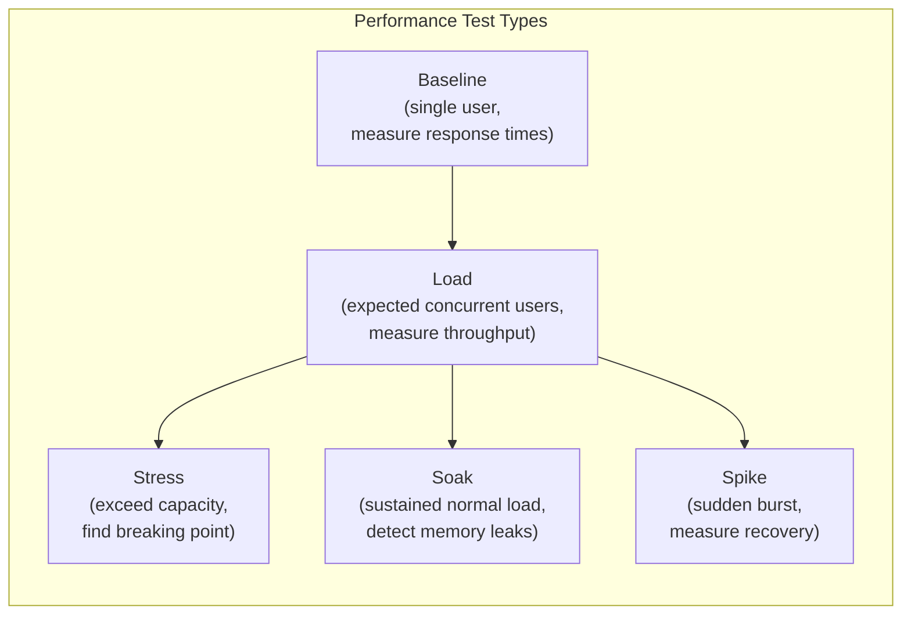

#### 8.2.1 Baseline Test

| Parameter | Value |
|-----------|-------|
| **Tool** | k6 |
| **VUs (Virtual Users)** | 1 |
| **Duration** | 60 seconds |
| **Target** | API Gateway `POST /soap` + full pipeline to Redis |
| **Metrics Collected** | Response time (min, avg, P50, P90, P95, P99, max), throughput |
| **Purpose** | Establish single-user latency floor for comparison |

#### 8.2.2 Load Test

| Parameter | Value |
|-----------|-------|
| **Tool** | k6 |
| **Ramp Profile** | 0→25 VUs over 1 min → hold 25 VUs for 5 min → ramp down 1 min |
| **Target** | Mixed: 60% core-app-1 PlannedOutage, 40% siebel ServiceRequest |
| **Pass Criteria** | P95 < 2s, error rate < 1%, all events arrive on Redis |

#### 8.2.3 Stress Test

| Parameter | Value |
|-----------|-------|
| **Tool** | k6 |
| **Ramp Profile** | 0→25→50→100→150→200 VUs, each step held for 2 min |
| **Target** | API Gateway `POST /soap` |
| **Purpose** | Find the throughput ceiling where errors begin or latency degrades |
| **Pass Criteria** | System degrades gracefully (returns 503/429, not crashes) |

#### 8.2.4 Soak Test

| Parameter | Value |
|-----------|-------|
| **Tool** | k6 |
| **VUs** | 25 (expected normal load) |
| **Duration** | 30 minutes |
| **Target** | Mixed endpoint traffic |
| **Purpose** | Detect memory leaks, connection pool exhaustion, queue buildup |
| **Pass Criteria** | Latency remains stable (< 10% drift), no OOM errors, SQS queue depth stays near 0 |

#### 8.2.5 Spike Test

| Parameter | Value |
|-----------|-------|
| **Tool** | k6 |
| **Profile** | 10 VUs → spike to 100 VUs for 30s → back to 10 VUs |
| **Target** | API Gateway `POST /soap` |
| **Purpose** | Measure recovery time after a sudden traffic burst |
| **Pass Criteria** | System returns to normal latency within 30s of spike ending |

### 8.3 Performance Test Scenarios

| Scenario ID | Description | Interfaces Tested | Tool |
|-------------|-------------|-------------------|------|
| PERF-S01 | Single PlannedOutage SOAP request (baseline) | IF-01 → IF-06 | k6 |
| PERF-S02 | Single ServiceRequest SOAP request (baseline) | IF-02 → IF-06 | k6 |
| PERF-S03 | 25 concurrent users — mixed workload (load) | IF-01, IF-02 → IF-08 | k6 |
| PERF-S04 | Ramp to 200 users — SOAP gateway only (stress) | IF-01 → IF-03 | k6 |
| PERF-S05 | SQS queue drain rate under backpressure | IF-04 → IF-06 | k6 + ElasticMQ admin |
| PERF-S06 | 30-minute sustained load (soak) | All interfaces | k6 |
| PERF-S07 | Traffic spike 10→100→10 VUs (spike) | IF-01 → IF-06 | k6 |
| PERF-S08 | Redis Pub/Sub fan-out latency (subscriber count impact) | IF-06 → IF-08 | Custom Node.js script |

### 8.4 Performance Test Architecture

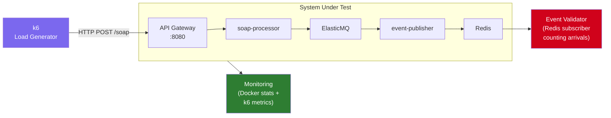

### 8.5 Performance Test Schedule

| Test Type | Frequency | Environment | Duration |
|-----------|-----------|-------------|----------|
| Baseline | Weekly (automated in CI) | Docker Compose (local) | ~2 min |
| Load | Weekly (automated in CI) | Docker Compose (local) | ~7 min |
| Stress | Pre-release | Dedicated perf environment | ~15 min |
| Soak | Pre-release | Dedicated perf environment | ~35 min |
| Spike | Pre-release | Docker Compose or dedicated | ~5 min |

### 8.6 Performance Acceptance Criteria

| Metric | Baseline | Load (25 VUs) | Stress (ceiling) | Soak (30 min) |
|--------|----------|---------------|-------------------|---------------|
| P95 Response Time | < 500ms | < 2s | Identified | Stable ± 10% |
| Throughput | Measured | ≥ 100 req/s | Max identified | Stable |
| Error Rate | 0% | < 1% | < 5% | < 0.1% |
| Event Delivery | 100% | 100% | ≥ 95% | 100% |
| SQS Queue Depth | 0 at rest | < 10 at steady state | Identified | Returns to 0 |
| Memory (containers) | Measured | < 2x baseline | < 3x baseline | No growth trend |

---

## 9. Test Environment Strategy

### 9.1 Environments

| Environment | Purpose | Infrastructure | Test Types Run |
|-------------|---------|---------------|----------------|
| **Local Dev** | Developer testing during feature work | Docker Compose + Node.js processes | Contract consumer, unit |
| **CI (Docker)** | Automated pipeline on every push | Docker Compose in GitHub Actions | All 75 automated tests |
| **Performance** | Dedicated for load/stress/soak tests | Docker Compose with resource limits | Performance suite |
| **Staging** | Pre-production with AWS-native services | Real AWS (SQS, SNS, ElasticCache) | Smoke + E2E subset |

### 9.2 Environment Setup

```bash
# ── Prerequisites ──────────────────────────────────────
# Docker Desktop, Node.js 18+, Java 17+, Maven 3.9+

# ── Start integration layer ───────────────────────────
cd integration-layer && docker compose up -d

# ── Start client applications ─────────────────────────
PORT=4001 npx tsx core-app-1/src/index.ts &
PORT=3002 npx tsx siebel/src/index.ts &

# ── Verify (Infrastructure tests should all pass) ─────
npm run test:integration
```

### 9.3 Test Data Isolation

Each test environment uses isolated identifiers:
- **Request IDs** include timestamps (`OUTAGE-20260227...`, `SBL-20260227...`)
- **ElasticMQ** is ephemeral (container restart clears all messages)
- **Redis** state is transient (pub/sub has no persistence)
- **No shared state** between test runs — each suite creates fresh data

---

## 10. Test Data Strategy

### 10.1 Data Categories

| Category | Description | Source | Lifecycle |
|----------|-------------|--------|-----------|
| **SOAP Templates** | Valid/invalid XML payloads | Hardcoded in test files | Static |
| **PlannedOutage params** | system, region, severity, description | Factory methods / JSON objects | Created per test |
| **ServiceRequest params** | type, account, contact, service, priority | Factory methods / JSON objects | Created per test |
| **IntegrationEvent schemas** | Expected event structure from Redis | Pact contract definitions | Versioned with pacts |
| **Performance payloads** | Parameterized SOAP with varying sizes | k6 scenario scripts | Generated at runtime |

### 10.2 Test Data Principles

1. **Self-contained** — Every test creates its own data. No test depends on another test's output.
2. **Deterministic** — Factory methods produce predictable values; timestamps and IDs are the only variable fields.
3. **Traceable** — Each test uses unique identifiers (e.g., `E2E-Test-System`, `ACC-E2E-001`) to correlate requests with events.
4. **No cleanup needed** — All data stores (ElasticMQ, Redis) are ephemeral. Docker restart is the reset mechanism.

---

## 11. Entry & Exit Criteria

### 11.1 Entry Criteria (per test level)

| Level | Criteria |
|-------|----------|
| **Contract Consumer** | Source code compiles; Pact library available |
| **Infrastructure** | Docker Compose stack healthy (`docker compose ps` shows all services `Up`) |
| **Integration API** | Entry criteria for Infrastructure + client apps (`core-app-1`, `siebel`) responding on health endpoints |
| **E2E Pipeline** | Entry criteria for Integration + ElasticMQ admin reachable + Redis `PING` returns `PONG` |
| **Performance** | Entry criteria for E2E + performance tool (k6) installed + no other workloads competing for resources |
| **Acceptance (Cucumber)** | Entry criteria for Integration + feature files reviewed by product owner |

### 11.2 Exit Criteria

| Level | Criteria |
|-------|----------|
| **Contract Consumer** | All consumer pact tests pass; pact files generated in `/pacts` |
| **Contract Provider** | All provider verification tests pass against generated pacts |
| **Infrastructure** | All 5 health checks pass (both suites) |
| **Integration API** | All 12 tests pass (both suites); no HTTP 5xx responses |
| **E2E Pipeline** | All 9 tests pass (both suites); all events arrive within 15s timeout |
| **Acceptance** | All Cucumber scenarios pass; product owner signs off |
| **Performance** | All acceptance criteria met (Section 8.6); no regressions from previous baseline |
| **Release** | All of the above + zero Critical/High defects open + manual test plan executed |

---

## 12. Risk-Based Testing

### 12.1 Risk Register

| Risk ID | Risk | Probability | Impact | Mitigation | Test Coverage |
|---------|------|:-----------:|:------:|------------|---------------|
| R01 | SOAP XML serialization breaks silently | Medium | High | Contract tests lock exact XML structure | 🟠 Consumer + Provider pacts |
| R02 | SQS message lost during processing | Low | Critical | E2E verifies event delivery with `waitForEvent` | 🟣 E2E pipeline tests |
| R03 | Redis Pub/Sub drops events under load | Medium | High | Performance soak test monitors event count | ⚡ Soak test (PERF-S06) |
| R04 | Event-publisher crashes on malformed SQS message | Medium | Medium | Exploratory testing (EXP-02) | ✋ Manual EXP-02 |
| R05 | API Gateway routes wrong path after Nginx config change | Low | High | Integration tests verify `/soap` routing | 🔵 API Gateway tests |
| R06 | IntegrationEvent schema drift between publisher and listener | Medium | High | Message contract tests (both suites) | 🟠 Message pacts |
| R07 | Memory leak under sustained load | Low | Medium | 30-min soak test monitors container memory | ⚡ Soak test (PERF-S06) |
| R08 | Concurrent multi-app messages cause cross-contamination | Low | Critical | E2E cross-app test + exploratory charter | 🟣 E2E + ✋ EXP-04 |

### 12.2 Risk-Based Test Prioritization

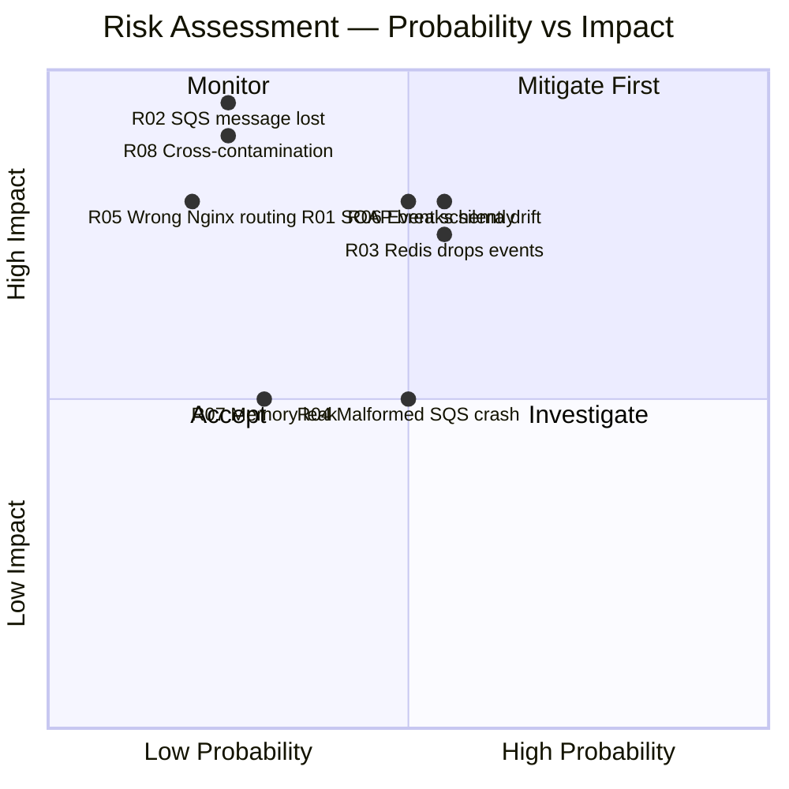

---

## 13. Defect Management

### 13.1 Severity Classification

| Severity | Definition | Example | Response SLA |
|----------|-----------|---------|:------------:|
| **S1 — Critical** | Complete pipeline failure; data loss | SQS messages not reaching Redis | Fix within 4 hours |
| **S2 — High** | Major feature broken; workaround exists | SOAP error response returns wrong error code | Fix within 1 business day |
| **S3 — Medium** | Minor feature issue; no data impact | Incorrect timestamp format in event metadata | Fix within 1 sprint |
| **S4 — Low** | Cosmetic or documentation issue | Health endpoint returns extra whitespace | Backlog |

### 13.2 Defect Lifecycle

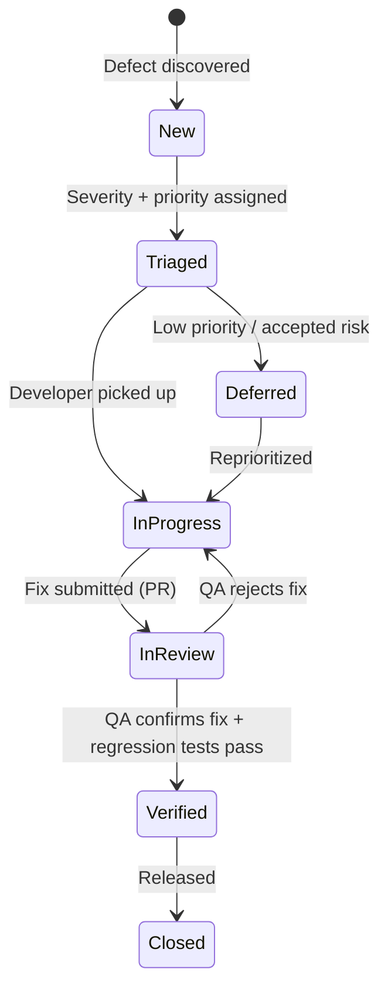

---

## 14. CI/CD Integration

### 14.1 Pipeline Stages

```mermaid
flowchart LR
    subgraph PR["Pull Request"]
        S1["1. Contract Consumer\n(no Docker)\n~5s"]
        S2["2. Contract Provider Msg\n(no Docker)\n~3s"]
    end

    subgraph CI["CI Pipeline"]
        S3["3. Docker Compose Up\n+ Health Check\n~30s"]
        S4["4. Infrastructure Tests\n~2s"]
        S5["5. Integration API Tests\n~10s"]
        S6["6. Contract Provider HTTP\n~5s"]
        S7["7. E2E Pipeline Tests\n~45s"]
        S8["8. Cucumber BDD\n~10s"]
    end

    subgraph Perf["Performance (Weekly)"]
        S9["9. Baseline + Load\n~10 min"]
    end

    subgraph Release["Pre-Release"]
        S10["10. Stress + Soak\n~50 min"]
        S11["11. Manual Test Plan"]
    end

    S1 --> S2 --> S3 --> S4 --> S5 --> S6 --> S7 --> S8
    S8 --> S9
    S9 --> S10 --> S11

    style S1 fill:#ffe0b2,stroke:#e65100
    style S2 fill:#ffe0b2,stroke:#e65100
    style S3 fill:#c8e6c9,stroke:#2e7d32
    style S4 fill:#c8e6c9,stroke:#2e7d32
    style S5 fill:#bbdefb,stroke:#1565c0
    style S6 fill:#ffe0b2,stroke:#e65100
    style S7 fill:#e1bee7,stroke:#6a1b9a
    style S8 fill:#fff9c4,stroke:#f9a825
    style S9 fill:#7B68EE,color:#fff
    style S10 fill:#7B68EE,color:#fff
    style S11 fill:#ccc,stroke:#666
```

### 14.2 Fail-Fast Ordering

Tests are ordered by **speed** and **independence** to provide the fastest feedback:

| Stage | Time | Blocks PR | Docker Required |
|-------|------|:---------:|:---------------:|
| 1. Contract Consumer | ~5s | ✅ | — |
| 2. Contract Provider (Msg) | ~3s | ✅ | — |
| 3. Docker Setup + Health | ~30s | ✅ | ✅ |
| 4. Infrastructure | ~2s | ✅ | ✅ |
| 5. Integration API | ~10s | ✅ | ✅ |
| 6. Contract Provider (HTTP) | ~5s | ✅ | ✅ |
| 7. E2E Pipeline | ~45s | ✅ | ✅ |
| 8. Cucumber BDD | ~10s | ✅ | ✅ |
| 9. Performance (Baseline/Load) | ~10 min | — | ✅ |

**Total CI time: ~2 min** (excluding performance). A contract consumer failure stops the pipeline in 5 seconds.

---

## 15. Team Structure & Responsibilities

### 15.1 Per-Application Team Ownership

Each application has its own development team that owns testing for their component. Cross-cutting concerns (contract testing, E2E, performance) are coordinated by the Platform QA team.

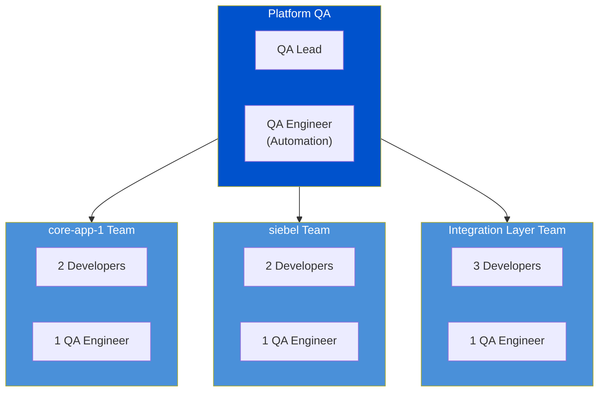

### 15.2 Team Testing Responsibilities

| Team | Owns | Test Types | Tools |
|------|------|-----------|-------|
| **core-app-1 Team** | `core-app-1/` source + consumer contracts | Contract Consumer (HTTP pacts for PlannedOutage), Integration API tests, Unit tests | Vitest, Pact (TS), JUnit 5, Pact JVM |
| **siebel Team** | `siebel/` source + consumer contracts + event listener | Contract Consumer (HTTP pacts for ServiceRequest), Integration API tests, Event listener tests | Vitest, Pact (TS), JUnit 5, Pact JVM |
| **Integration Layer Team** | `integration-layer/` services (API Gateway, soap-processor, event-publisher, pubsub-subscriber) | Contract Provider verification, Infrastructure tests, E2E pipeline tests, Docker Compose config | Vitest, JUnit 5, Playwright, Docker Compose |
| **Platform QA** | Cross-cutting quality, test strategy, tooling, CI pipeline | E2E orchestration, Performance testing, Manual test plan, Xray administration, Cucumber BDD, Security testing | k6, Xray, Cucumber 7, OWASP ZAP, GitHub Actions |

### 15.3 RACI Matrix

| Activity | core-app-1 Team | siebel Team | Integration Layer Team | Platform QA | Product Owner |
|----------|:---:|:---:|:---:|:---:|:---:|
| Unit / Component tests | R/A | R/A | R/A | C | — |
| Contract Consumer tests | R/A | R/A | C | C | — |
| Contract Provider verification | C | C | R/A | C | — |
| Integration API tests | R | R | R | A | — |
| E2E Pipeline tests | C | C | R | A | — |
| Cucumber BDD scenarios | C | C | C | R | A |
| Performance tests | I | I | C | R/A | I |
| Manual test execution | — | — | C | R/A | C |
| Exploratory testing | C | C | C | R/A | — |
| Security assessment | C | C | C | R/A | I |
| Xray test management | I | I | I | R/A | C |
| Defect triage | R | R | R | A | C |
| CI pipeline maintenance | C | C | R | A | — |

**R** = Responsible, **A** = Accountable, **C** = Consulted, **I** = Informed

### 15.4 Roles

| Role | Responsibilities |
|------|-----------------|
| **App Developer** | Write and maintain automated tests for their app; fix defects; author consumer pacts |
| **Integration Developer** | Maintain integration-layer services; verify provider pacts; manage Docker Compose configs |
| **QA Engineer (per team)** | Execute manual tests; run exploratory sessions; maintain Cucumber features; triage defects |
| **QA Lead (Platform)** | Own test strategy; manage Xray configuration; coordinate cross-team testing; performance test design |
| **QA Automation Engineer** | Build and maintain automation frameworks (TS + Java); CI pipeline test stages; Xray CI integration |
| **Tech Lead** | Review test strategy; approve risk register; define exit criteria; ensure CI pipeline coverage |
| **Product Owner** | Review and approve Cucumber BDD scenarios; sign off on acceptance criteria |
| **DevOps / SRE** | Maintain CI pipeline; manage Docker Compose + performance environments; set up monitoring |

---

## 16. Test Schedule

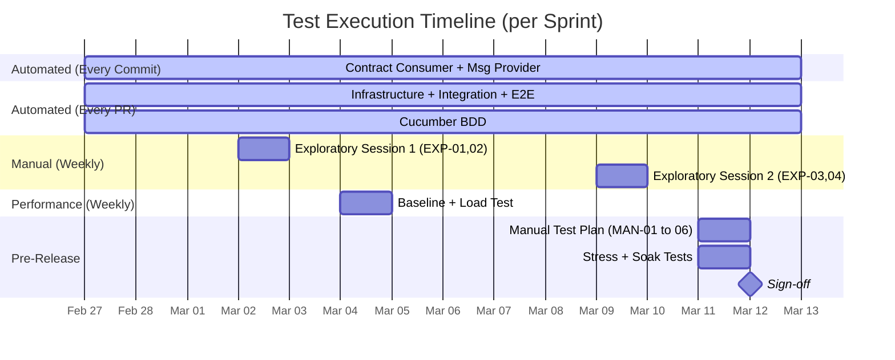

---

## 17. Metrics & Reporting

### 17.1 Key Metrics

| Metric | Formula | Target | Frequency |
|--------|---------|--------|-----------|
| **Automation Rate** | Automated tests / Total executable test cases | ≥ 90% | Monthly |
| **Pass Rate** | Passed tests / Total tests executed | ≥ 98% (CI) | Per run |
| **Defect Escape Rate** | Defects found in staging or prod / Total defects | < 5% | Per release |
| **Mean Time to Detection** | Avg time from code commit to test failure | < 5 min | Per sprint |
| **Contract Compliance** | Verified pacts / Total pacts | 100% | Per run |
| **P95 Response Time Trend** | P95 over time across baseline runs | No upward trend | Weekly |
| **Event Delivery Rate** | Events received on Redis / SOAP requests sent | 100% (normal load) | Per E2E run |

### 17.2 Dashboard Indicators

| Indicator | Green | Yellow | Red |
|-----------|-------|--------|-----|
| CI pass rate | ≥ 98% | 90–98% | < 90% |
| E2E pipeline latency P95 | < 2s | 2–5s | > 5s |
| Open S1/S2 defects | 0 | 1–2 | ≥ 3 |
| Pact verification | All pass | — | Any failure |
| Soak test memory trend | Flat | < 10% growth | > 10% growth |

### 17.3 Reporting Cadence

| Report | Audience | Frequency | Content |
|--------|----------|-----------|---------|
| CI Test Summary | Dev team | Per PR | Pass/fail counts, failure details, duration |
| Sprint Test Report | Scrum team | End of sprint | Metrics summary, defect status, coverage gaps |
| Performance Trend | Tech lead + SRE | Weekly | Latency/throughput trends, comparison to baseline |
| Release Readiness | All stakeholders | Pre-release | Exit criteria checklist, risk assessment, sign-off |

---

## Appendix A: Document Revision History

| Version | Date | Author | Changes |
|---------|------|--------|---------|
| 1.0 | 2026-02-27 | QA Team | Initial test strategy |
| 1.1 | 2026-02-28 | QA Team | Added Section 5 (Tooling & Test Management — Xray migration), per-app team structure (Section 15), complete tool inventory |

## Appendix B: Reference Documents

| Document | Location |
|----------|----------|
| Testing Documentation (detailed test inventory) | `docs/testing-documentation.md` |
| Contract Testing Strategy | `docs/contract-testing-strategy.md` |
| Contract Testing Analysis | `docs/do-we-need-contract-testing.md` |
| Docker Compose Configuration | `integration-layer/docker-compose.yml` |
| Java Framework README | `playwright-java-framework/README.md` |
