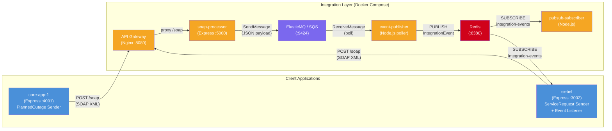
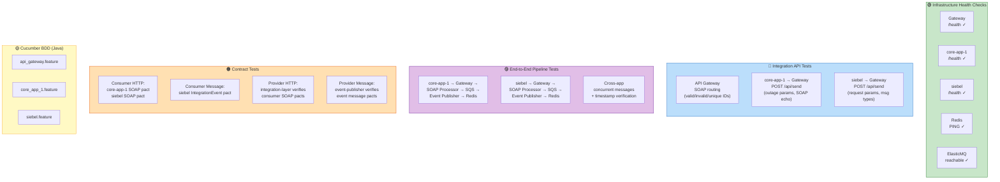
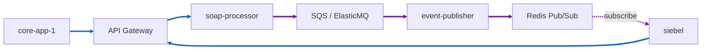
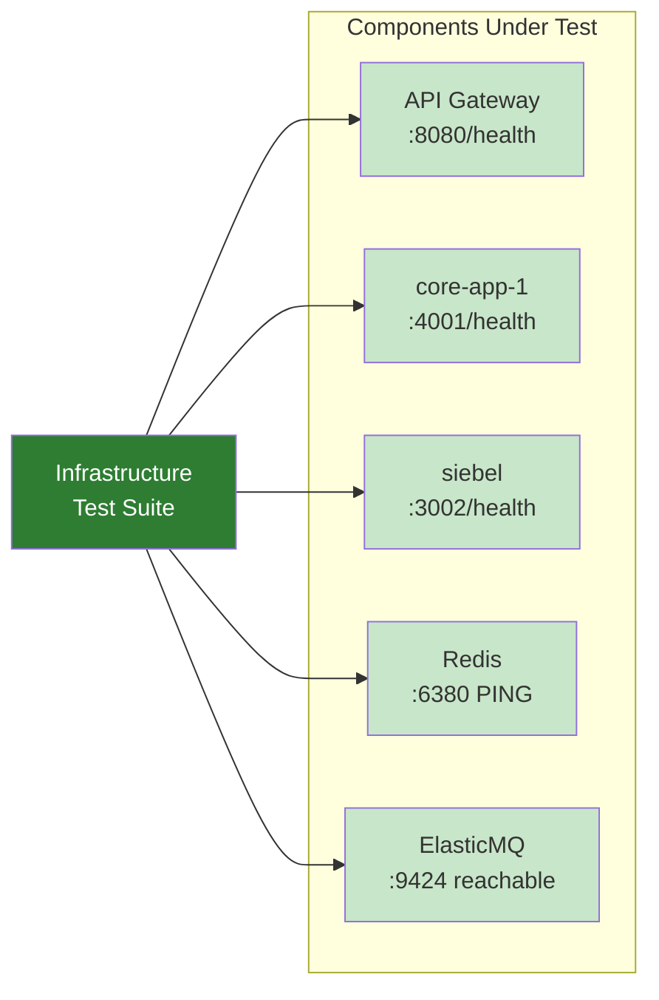
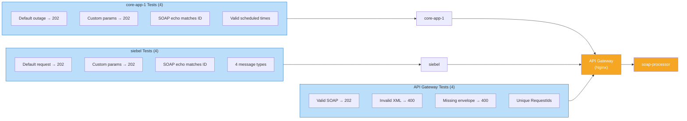
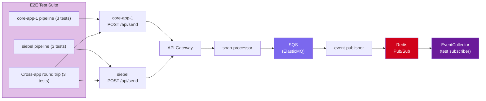
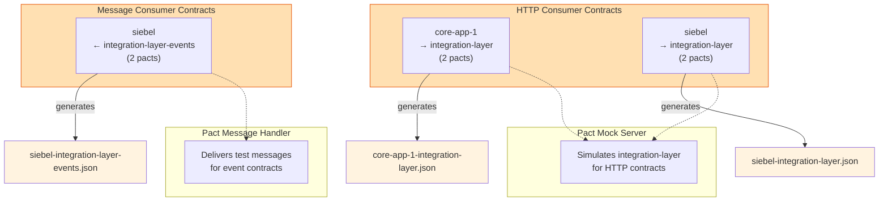
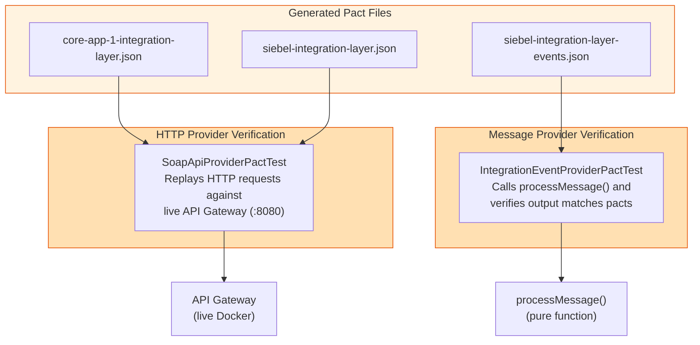
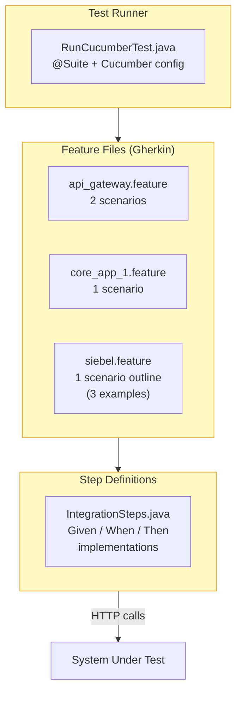
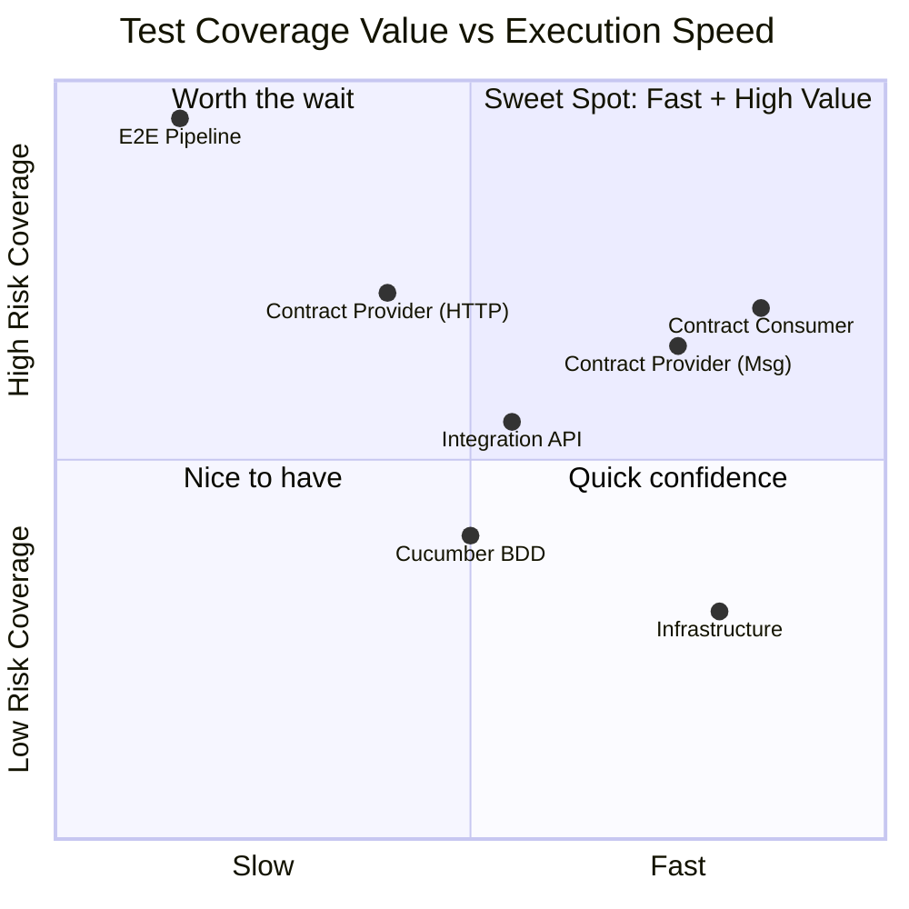

# Testing Documentation

> **Comprehensive test coverage report for the AWS Integration Example project.**
> Covers both TypeScript (Vitest + Pact) and Java (JUnit 5 + Playwright + Pact JVM + Cucumber) test suites.

---

## Table of Contents

- [System Architecture](#system-architecture)
- [Test Coverage Overview](#test-coverage-overview)
- [Test Layers Diagram](#test-layers-diagram)
- [1. Infrastructure Health Checks](#1-infrastructure-health-checks)
- [2. Integration API Tests](#2-integration-api-tests)
- [3. End-to-End Pipeline Tests](#3-end-to-end-pipeline-tests)
- [4. Contract Tests – Consumer](#4-contract-tests--consumer)
- [5. Contract Tests – Provider](#5-contract-tests--provider)
- [6. Cucumber BDD Tests](#6-cucumber-bdd-tests-java-only)
- [Test Count Summary](#test-count-summary)
- [Coverage Rationale Matrix](#coverage-rationale-matrix)

---

## System Architecture

**Data Flow:**

1. **core-app-1** or **siebel** sends a `POST /api/send` → builds SOAP XML → forwards to **API Gateway**
2. **API Gateway** (Nginx) proxies `/soap` to **soap-processor**
3. **soap-processor** parses SOAP XML, extracts payload, sends JSON to **SQS** (ElasticMQ)
4. **event-publisher** polls SQS, transforms message into an `IntegrationEvent`, publishes to **Redis Pub/Sub**
5. **pubsub-subscriber** and **siebel's event-listener** receive the event

---

## Test Coverage Overview

The following diagram shows every integration point in the system and which test layers cover it. Each colored zone represents a test category.

---

## Test Layers Diagram

This diagram shows which portion of the architecture each test layer exercises, from narrow (unit-like) to broad (full system).

| Color | Layer | Scope |
|-------|-------|-------|
| 🟢 Green | Infrastructure | Each service individually (health/ping) |
| 🔵 Blue | Integration API | Client → Gateway → soap-processor (HTTP request/response) |
| 🟣 Purple | End-to-End | Client → Gateway → soap-processor → SQS → event-publisher → Redis (full async pipeline) |
| 🟠 Orange | Contract | Isolated consumer expectations + provider verification (no live infra needed for consumers) |
| 🟡 Yellow | Cucumber BDD | Same scope as Integration API, expressed in Gherkin for business readability |

---

## 1. Infrastructure Health Checks

**Purpose:** Verify all Docker services and external dependencies are running and reachable before other tests execute.

### Tests (5 per suite)

| # | Test | Assertion |
|---|------|-----------|
| 1 | API Gateway is healthy | `GET /health` → `{"status":"ok","service":"api-gateway"}` |
| 2 | core-app-1 is healthy | `GET /health` → `{"status":"ok","service":"core-app-1"}` |
| 3 | siebel is healthy | `GET /health` → `{"status":"ok","service":"siebel"}` |
| 4 | Redis is reachable | `PING` → `PONG` |
| 5 | ElasticMQ is reachable | `GET /` returns any HTTP status |

### Files

| Suite | File |
|-------|------|
| TypeScript | `tests/integration/infrastructure.test.ts` |
| Java | `playwright-java-framework/.../integration/InfrastructureTest.java` |

### Why This Coverage Matters

> **Fail-fast guarantee.** If any infrastructure component is down, all downstream tests would fail with misleading connection errors. Health checks provide a clear diagnostic signal—when these fail, the problem is environment setup, not application logic. This saves significant debugging time in CI pipelines and local development.

---

## 2. Integration API Tests

**Purpose:** Verify that each application's REST endpoint correctly builds SOAP XML, sends it through the API Gateway, and the integration-layer returns proper responses.

### Tests (12 per suite)

| Group | # | Test | Key Assertions |
|-------|---|------|----------------|
| **API Gateway** | 1 | Valid SOAP → 202 | Status 202, body contains `<res:Status>Accepted</res:Status>` |
| | 2 | Invalid XML → 400 | Status 400, body contains `Missing SOAP Body` |
| | 3 | Missing envelope → 400 | Status 400, body contains `Missing SOAP Body` |
| | 4 | Unique RequestIds | 3 consecutive requests produce 3 distinct IDs |
| **core-app-1** | 5 | Default outage | `outageId` starts with `OUTAGE-`, system=`Siebel CRM`, severity=`MEDIUM` |
| | 6 | Custom parameters | All custom fields (system, region, severity, description) echoed back |
| | 7 | SOAP response ID match | Response XML `<res:RequestId>` matches sent outageId |
| | 8 | Valid scheduled times | `scheduledEnd - scheduledStart ≈ 2 hours` |
| **siebel** | 9 | Default request | `requestId` starts with `SBL-`, action=`ServiceRequest`, accountId=`ACC-2048` |
| | 10 | Custom parameters | All 6 custom fields (type, account, contact, service, priority, description) verified |
| | 11 | SOAP response ID match | Response XML `<res:RequestId>` matches sent requestId |
| | 12 | Different message types | `ServiceRequest`, `AccountUpdate`, `ContactChange`, `BillingInquiry` all succeed |

### Files

| Suite | File |
|-------|------|
| TypeScript | `tests/integration/api-gateway.test.ts` |
| TypeScript | `tests/integration/core-app-1.test.ts` |
| TypeScript | `tests/integration/siebel.test.ts` |
| Java | `playwright-java-framework/.../integration/ApiGatewayTest.java` |
| Java | `playwright-java-framework/.../integration/CoreApp1Test.java` |
| Java | `playwright-java-framework/.../integration/SiebelTest.java` |

### Why This Coverage Matters

> **Validates the synchronous request-response contract** between each client application and the integration layer. These tests catch:
> - SOAP XML serialization bugs (wrong tags, missing namespaces, encoding issues)
> - API Gateway routing misconfigurations (Nginx proxy rules)
> - soap-processor parsing regressions (body extraction, error handling)
> - Parameter passthrough integrity (custom fields not lost in transit)
>
> Without these, a change to the SOAP XML structure in one app could silently break the integration-layer without anyone noticing until production.

---

## 3. End-to-End Pipeline Tests

**Purpose:** Verify the **complete asynchronous pipeline** from initial HTTP request through SQS message queuing to Redis Pub/Sub event delivery.

### Tests (9 per suite)

| Group | # | Test | What It Verifies |
|-------|---|------|-----------------|
| **core-app-1 → Redis** | 1 | PlannedOutage full pipeline | Event arrives with correct `eventType`, `source`, `requestId`, `status=PROCESSED`, and full payload |
| | 2 | Default parameters preserved | Default `System=Siebel CRM`, `Region=US-WEST-2`, `Severity=MEDIUM` survive the pipeline |
| | 3 | Multiple distinct events | 3 outage notifications → 3 distinct events on Redis |
| **siebel → Redis** | 4 | ServiceRequest full pipeline | All 6 payload fields (Action, AccountId, Contact, ServiceType, Priority, Source) arrive intact |
| | 5 | AccountUpdate full pipeline | `Action=AccountUpdate` with custom account + priority |
| | 6 | Default parameters preserved | Default `AccountId=ACC-2048`, `ContactName=John Doe`, `Priority=NORMAL` survive |
| **Cross-app** | 7 | core-app-1 → event bus | Outage event reaches Redis with correct Action + System |
| | 8 | siebel → event bus | Service request event reaches Redis with correct Action + AccountId |
| | 9 | Timestamps & metadata | `timestamp ≥ beforeSend`, `source=event-publisher`, `originalSource=soap-processor` |

### EventCollector Pattern

Both TypeScript and Java suites use an **EventCollector** that subscribes to Redis Pub/Sub `integration-events` topic and provides a `waitForEvent(predicate, timeout)` method to match arriving events by `requestId` or other fields.

### Files

| Suite | File |
|-------|------|
| TypeScript | `tests/e2e/full-pipeline.test.ts` |
| Java | `playwright-java-framework/.../e2e/FullPipelineTest.java` |

### Why This Coverage Matters

> **The only tests that verify the asynchronous message pipeline works end-to-end.** This is the most critical coverage area because:
> 1. **Message queuing is eventually consistent** — SQS polling + Redis Pub/Sub introduce timing dependencies that are invisible to synchronous tests
> 2. **Data transformation fidelity** — The payload passes through 4 services (app → soap-processor → SQS → event-publisher → Redis), with XML→JSON→JSON transformations at each hop. Any serialization bug would silently corrupt data
> 3. **Multi-app isolation** — Verifies that messages from different apps don't interfere with each other when processed concurrently
> 4. **Event schema integrity** — The `IntegrationEvent` structure (`eventType`, `source`, `timestamp`, `detail.requestId`, `detail.processedPayload`, `detail.status`) is the system's observable output. If this breaks, downstream consumers (like siebel's event-listener) fail silently

---

## 4. Contract Tests – Consumer

**Purpose:** Define and lock down the expectations each consumer has of the integration-layer's API, **without needing any live services running**.

### HTTP Consumer Pacts (4 tests per suite)

| Consumer | # | Interaction | Expected Response |
|----------|---|------------|-------------------|
| **core-app-1** | 1 | `POST /soap` with PlannedOutage SOAP XML | 202, `Content-Type: text/xml` |
| | 2 | `POST /soap` with XML missing SOAP Body | 400, `Content-Type: text/xml` |
| **siebel** | 3 | `POST /soap` with ServiceRequest SOAP XML | 202, `Content-Type: text/xml` |
| | 4 | `POST /soap` with AccountUpdate SOAP XML | 202, `Content-Type: text/xml` |

### Message Consumer Pacts (2 tests per suite)

| Consumer | # | Message Description | Key Fields Verified |
|----------|---|---------------------|-------------------|
| **siebel** | 1 | IntegrationEvent with status PROCESSED | `eventType`, `source`, `timestamp`, `detail.requestId`, `detail.originalSource`, `detail.processedPayload`, `detail.status` |
| | 2 | IntegrationEvent with minimal payload | `eventType`, `detail.processedPayload` (empty), `detail.status` |

### Files

| Suite | File | Type |
|-------|------|------|
| TypeScript | `core-app-1/tests/contract/soap-api.consumer.pact.test.ts` | HTTP |
| TypeScript | `siebel/tests/contract/soap-api.consumer.pact.test.ts` | HTTP |
| TypeScript | `siebel/tests/contract/integration-event.consumer.pact.test.ts` | Message |
| Java | `playwright-java-framework/.../contract/consumer/CoreApp1SoapConsumerPactTest.java` | HTTP |
| Java | `playwright-java-framework/.../contract/consumer/SiebelSoapConsumerPactTest.java` | HTTP |
| Java | `playwright-java-framework/.../contract/consumer/SiebelEventConsumerPactTest.java` | Message |

### Why This Coverage Matters

> **Consumer contracts are the safety net for independent deployability.** They matter because:
> 1. **Shift-left detection** — These tests run without Docker or any live service, making them fast (~seconds) and ideal for pre-commit hooks or early CI stages
> 2. **API evolution safety** — If the integration-layer changes its SOAP response format or event schema, the generated pact files will cause provider tests to fail *before* deployment
> 3. **Documentation as code** — Each pact file is a machine-readable specification of the exact SOAP XML structures and event schemas each consumer depends on
> 4. **Multi-repo readiness** — In a multi-repo setup, consumer pacts are published to a Pact Broker. The `can-i-deploy` check prevents incompatible versions from reaching production

---

## 5. Contract Tests – Provider

**Purpose:** Verify that the real integration-layer (or its business logic) satisfies all consumer expectations defined in the pact files.

### HTTP Provider Verification

The Pact Verifier replays every HTTP interaction from the consumer pact files against the **live API Gateway** (Nginx → soap-processor chain). This proves the real provider returns responses matching consumer expectations.

| Provider | Consumers Verified | Requires |
|----------|--------------------|----------|
| `integration-layer` | core-app-1, siebel | Docker stack running (`docker compose up -d`) |

### Message Provider Verification

Invokes `processMessage()` (event-publisher's core transformation function) with test data and verifies the output matches the event schema defined in siebel's message pact.

| Provider | Consumers Verified | Requires |
|----------|--------------------|----------|
| `integration-layer-events` | siebel | Nothing (pure function, runs standalone) |

### Files

| Suite | File | Type |
|-------|------|------|
| TypeScript | `integration-layer/tests/contract/soap-api.provider.pact.test.ts` | HTTP |
| TypeScript | `integration-layer/tests/contract/integration-event.provider.pact.test.ts` | Message |
| Java | `playwright-java-framework/.../contract/provider/SoapApiProviderPactTest.java` | HTTP |
| Java | `playwright-java-framework/.../contract/provider/IntegrationEventProviderPactTest.java` | Message |

### Why This Coverage Matters

> **Provider verification closes the contract testing loop.** Without it:
> 1. **Consumer pacts are just wishful thinking** — A pact file only describes what consumers *expect*; provider verification proves the provider *actually delivers*
> 2. **Catches breaking changes at the source** — If a developer modifies soap-processor's response format or event-publisher's message schema, provider tests fail immediately
> 3. **Message verification avoids integration failures** — The message provider test exercises the actual `processMessage()` function, catching transformation bugs that wouldn't surface until a full E2E run
> 4. **Enables can-i-deploy workflows** — In a Pact Broker setup, provider verification results combined with consumer pacts enable automated compatibility checks before deployment

---

## 6. Cucumber BDD Tests (Java Only)

**Purpose:** Express integration scenarios in **business-readable Gherkin** syntax, bridging communication between technical and non-technical stakeholders.

### Scenarios

| Feature File | Scenario | Steps |
|-------------|----------|-------|
| `api_gateway.feature` | Valid SOAP → 202 | Given integration layer running, When send valid SOAP, Then 202 + Accepted |
| `api_gateway.feature` | Invalid XML → 400 | Given integration layer running, When send invalid XML, Then 400 + Missing SOAP Body |
| `core_app_1.feature` | Default outage | Given core-app-1 running, When send outage notification, Then success + ID starts with OUTAGE- |
| `siebel.feature` | ServiceRequest | Given siebel running, When send type ServiceRequest, Then success + action matches |
| `siebel.feature` | AccountUpdate | Given siebel running, When send type AccountUpdate, Then success + action matches |
| `siebel.feature` | BillingInquiry | Given siebel running, When send type BillingInquiry, Then success + action matches |

### Files

| File | Purpose |
|------|---------|
| `playwright-java-framework/src/test/resources/features/api_gateway.feature` | API Gateway scenarios |
| `playwright-java-framework/src/test/resources/features/core_app_1.feature` | core-app-1 scenarios |
| `playwright-java-framework/src/test/resources/features/siebel.feature` | siebel scenarios (outline with 3 examples) |
| `playwright-java-framework/.../cucumber/IntegrationSteps.java` | Step definitions |
| `playwright-java-framework/.../cucumber/RunCucumberTest.java` | Cucumber test runner |

### Why This Coverage Matters

> **BDD tests serve a dual purpose — verification and documentation:**
> 1. **Living documentation** — Feature files are readable by product owners, QA, and developers. They serve as always-up-to-date executable specifications
> 2. **Stakeholder communication** — Non-technical team members can review `.feature` files to understand exactly what the system does, without reading Java/TypeScript code
> 3. **Scenario Outline for combinatorial coverage** — The siebel feature uses `Scenario Outline` with `Examples` to test multiple message types with a single scenario template, reducing duplication while increasing coverage
> 4. **Reusable step library** — Step definitions in `IntegrationSteps.java` create a vocabulary (`Given the integration layer is running`, `When I send a valid SOAP request`) that can be composed into new scenarios without writing new code

---

## Test Count Summary

### TypeScript (Vitest + Pact)

| Category | File | Tests |
|----------|------|-------|
| Infrastructure | `tests/integration/infrastructure.test.ts` | 5 |
| API Gateway | `tests/integration/api-gateway.test.ts` | 4 |
| core-app-1 API | `tests/integration/core-app-1.test.ts` | 4 |
| siebel API | `tests/integration/siebel.test.ts` | 4 |
| E2E Pipeline | `tests/e2e/full-pipeline.test.ts` | 9 |
| Contract Consumer (HTTP) | `core-app-1/.../soap-api.consumer.pact.test.ts` | 2 |
| Contract Consumer (HTTP) | `siebel/.../soap-api.consumer.pact.test.ts` | 2 |
| Contract Consumer (Message) | `siebel/.../integration-event.consumer.pact.test.ts` | 2 |
| Contract Provider (HTTP) | `integration-layer/.../soap-api.provider.pact.test.ts` | 2 |
| Contract Provider (Message) | `integration-layer/.../integration-event.provider.pact.test.ts` | 1 |
| **Total** | **10 files** | **35** |

### Java (JUnit 5 + Playwright + Pact JVM + Cucumber)

| Category | File | Tests |
|----------|------|-------|
| Infrastructure | `InfrastructureTest.java` | 5 |
| API Gateway | `ApiGatewayTest.java` | 4 |
| core-app-1 API | `CoreApp1Test.java` | 4 |
| siebel API | `SiebelTest.java` | 4 |
| E2E Pipeline | `FullPipelineTest.java` | 9 |
| Contract Consumer (HTTP) | `CoreApp1SoapConsumerPactTest.java` | 2 |
| Contract Consumer (HTTP) | `SiebelSoapConsumerPactTest.java` | 2 |
| Contract Consumer (Message) | `SiebelEventConsumerPactTest.java` | 2 |
| Contract Provider (HTTP) | `SoapApiProviderPactTest.java` | 2 |
| Contract Provider (Message) | `IntegrationEventProviderPactTest.java` | 2 |
| Cucumber BDD | `RunCucumberTest.java` + 3 features | 4 |
| **Total** | **13 files** | **40** |

### Combined Total: **75 tests** across **23 files**

---

## Coverage Rationale Matrix

| Layer | Speed | Risk Covered | When It Catches Bugs |
|-------|-------|-------------|---------------------|
| **Infrastructure** | ⚡ Fast (~1s) | Environment setup | Before all other tests run — avoids misleading failures |
| **Integration API** | 🔵 Medium (~5s) | SOAP structure, routing, parameter handling | During development — immediate feedback on API changes |
| **E2E Pipeline** | 🐢 Slow (~30s) | Async message flow, data transformation, multi-service coordination | Pre-merge — catches integration bugs invisible to faster tests |
| **Contract Consumer** | ⚡ Fast (~2s) | API/event schema drift | Pre-commit — no infra needed, catches incompatible changes early |
| **Contract Provider** | 🔵 Medium (~5s) | Provider breaking changes | CI pipeline — proves provider still satisfies all consumers |
| **Cucumber BDD** | 🔵 Medium (~5s) | Business logic expressed as scenarios | Sprint review — validates features match acceptance criteria |

---

## Coverage Gaps & Future Considerations

| Area | Current Status | Recommendation |
|------|---------------|----------------|
| **Negative E2E paths** | Only happy-path pipeline tested | Add tests for SQS unavailability, Redis down mid-pipeline |
| **Performance / Load** | Not tested | Add k6 or Artillery load tests for throughput under concurrent SOAP submissions |
| **Security** | Not tested | Add tests for malformed SOAP injection, oversized payloads, auth headers |
| **Retry / Dead-letter** | Not tested | Verify event-publisher retry logic and DLQ behavior when processing fails |
| **Multi-repo Pact Broker** | Pacts stored locally in `/pacts` | Migrate to Pact Broker for `can-i-deploy` workflows in CI/CD |
